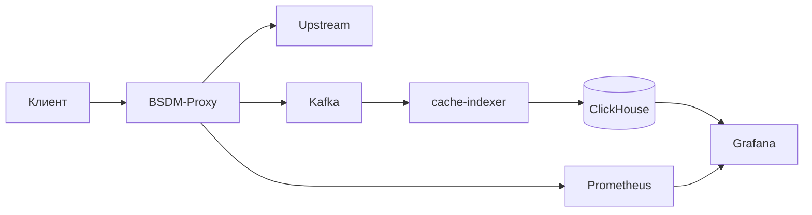

# BSDM-Proxy

[](https://github.com/onixus/bsdm-proxy/actions/workflows/rust.yml)
[](https://github.com/onixus/bsdm-proxy/actions/workflows/e2e.yml)
[](LICENSE)
[](https://github.com/onixus/bsdm-proxy/releases)

BSDM-Proxy — кеширующий HTTP/HTTPS forward proxy на Rust с MITM TLS,
аутентификацией, ACL, категоризацией, аналитикой трафика и опциональными
security-модулями.

Текущая версия workspace: **`0.6.1-1`**.

> Проект содержит функции разной зрелости. Перед развёртыванием прочитайте
> [матрицу статуса](docs/project-status.md): наличие кода или UI не означает
> production-ready.

> HTTPS MITM допустим только в управляемой среде, с информированием пользователей,
> контролем доступа к CA key и соблюдением применимого законодательства.

## Основные возможности

| Область | Возможности |
|---|---|
| Proxy | HTTP forward proxy, CONNECT, HTTPS MITM, HTTP/2 upstream |
| Кеш | Sharded L1, mmap spill, compression, revalidation, Redis L2, hierarchy |
| Политики | Basic/LDAP/NTLM/Kerberos auth, ACL, categorization, rate limiting |
| Аналитика | Kafka, cache-indexer, ClickHouse, Search API, Grafana |
| Detection | alert-worker, UEBA/phishing/beacon ML, threat-score write-back |
| Extensions | DNS sinkhole/DoH/DoT, semantic cache, WASM, ICAP, AWG |
| Operations | REST/gRPC control plane, Prometheus, Helm, systemd packaging |

Большинство optional/experimental-компонентов выключено по умолчанию. Исключения,
включая встроенные DLP-паттерны, перечислены в
[ограничениях](docs/project-status.md#известные-ограничения).

## Архитектура



Основные порты:

| Компонент | Порт | Назначение |
|---|---:|---|
| proxy | 1488 | HTTP proxy / CONNECT |
| proxy control | 9090 | `/health`, `/ready`, `/metrics`, REST control API |
| cache-indexer | 8080 | `/health`, `/metrics`, `/api/search` |
| ICP | 3130/udp | cache hierarchy, opt-in |
| Kafka | 9092 | cache events |
| ClickHouse | 8123 / 9000 | HTTP / native |
| Prometheus | 9091 | compose UI |
| Grafana | 3000 | dashboards |

Подробности: [архитектура](docs/architecture/overview.md) и
[структура репозитория](docs/architecture/structure.md).

## Быстрый старт

### Lite: proxy + SQLite

Подходит для локальной разработки и проверки MITM без Kafka/ClickHouse:

```bash
./scripts/gen-ca.sh
docker compose -f docker-compose.lite.yml up -d --build

curl http://127.0.0.1:9090/health
curl --cacert certs/ca.crt \
  -x http://127.0.0.1:1488 \
  https://httpbin.org/get
curl 'http://127.0.0.1:8080/api/search?limit=5'
```

Подробнее: [Lite mode](docs/getting-started/lite-mode.md).

### Analytics stack

```bash
./scripts/gen-ca.sh
docker compose up -d --build
docker compose ps
```

Команда запускает proxy, Kafka, Zookeeper, ClickHouse, cache-indexer,
Prometheus, Alertmanager и Grafana. Дополнительные профили:

```bash
docker compose --profile alerts --profile ml up -d --build
docker compose --profile dns-sinkhole up -d --build
docker compose --profile icap up -d
```

Это не означает, что все optional-функции включены и сконфигурированы. См.
[deployment guide](docs/getting-started/deployment.md).

### Пилот на 100 пользователей

Референс для пилота без DLP, reverse proxy, ICAP, ClamAV и HA, с хранением до
5 суток:

- **12 vCPU**;
- **24 GiB RAM**;
- **200 GB NVMe**;
- **1 Gbit/s** network.

Расчёт, TTL и критерии приёмки:
[Pilot deployment](docs/getting-started/pilot-deployment.md).
Готовые Compose overrides находятся в `docker-compose.pilot.yml`.

## Сборка

Требования:

- Rust stable, совместимый с зависимостями workspace;
- `libssl-dev`, `pkg-config`, `cmake`, `librdkafka-dev`, `libclang-dev`.

```bash
cargo build --release --workspace
```

Основные Cargo features proxy:

| Feature | Назначение |
|---|---|
| `kafka` | Kafka event pipeline, включён по умолчанию |
| `auth-ldap`, `auth-ntlm`, `auth-kerberos` | дополнительные auth backend |
| `grpc` | gRPC control plane |
| `wasm` | Wasmtime request hook |

Lite build:

```bash
cargo build --release \
  -p bsdm-proxy --bin proxy \
  --no-default-features --features auth-basic
```

## Проверки

```bash
cargo fmt --all -- --check
cargo clippy --workspace --all-targets -- -D warnings
cargo test --workspace --all-targets
python3 scripts/check-doc-links.py
```

E2E:

```bash
./scripts/run-smoke-tests.sh
./scripts/run-e2e-tests.sh
```

Подробности: [Development guide](docs/ops-and-dev/development.md).

## Документация

| Документ | Назначение |
|---|---|
| [Documentation index](docs/README.md) | Полная карта документации |
| [Project status](docs/project-status.md) | Зрелость и ограничения функций |
| [Pilot deployment](docs/getting-started/pilot-deployment.md) | 100 пользователей, TTL 5 дней |
| [Capacity planning](docs/architecture/capacity-planning.md) | Формулы и масштабирование |
| [Configuration](docs/ops-and-dev/configuration.md) | Переменные окружения |
| [Architecture](docs/architecture/overview.md) | Компоненты и потоки |
| [Roadmap](docs/roadmap.md) | Будущие работы |
| [Documentation maintenance](docs/maintenance.md) | Правила и Wiki sync |

GitHub Wiki публикуется как зеркало канонических файлов из `docs/`.

## Лицензия

[MIT License](LICENSE). Состав и лицензии сторонних компонентов:
[NOTICE](NOTICE) и [licensing](docs/ops-and-dev/licensing.md).
