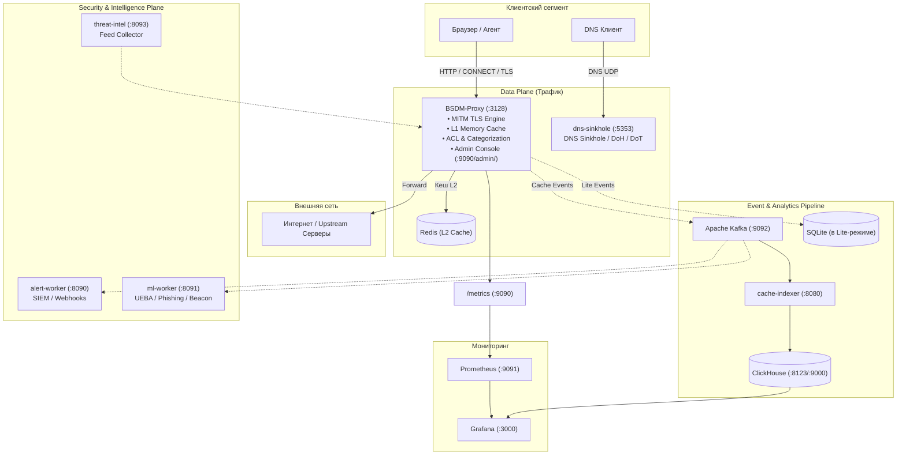

# BSDM-Proxy

<div align="center">

[](https://github.com/onixus/bsdm-proxy/actions/workflows/ci.yml)
[](https://github.com/onixus/bsdm-proxy/actions/workflows/docs.yml)
[](https://github.com/onixus/bsdm-proxy/actions/workflows/admin-console.yml)
[](LICENSE)
[](https://github.com/onixus/bsdm-proxy/releases)
[](https://www.rust-lang.org)

**Высокопроизводительный корпоративный кеширующий HTTP/HTTPS Forward Proxy & Secure Web Gateway (SWG) на Rust.**

[Возможности](#основные-возможности) • [Архитектура](#архитектура) • [Быстрый старт](#быстрый-старт) • [Сборка](#сборка-и-feature-flags) • [Документация](#документация)

</div>

---

**BSDM-Proxy** — это модульный корпоративный прокси-сервер нового поколения, спроектированный для обеспечения высокой пропускной способности, глубокого анализа трафика (MITM TLS-инспекция), многоуровневого кеширования, гранулярных политик доступа (ACL), гибкой аутентификации и непрерывной аналитики безопасности (Kafka → ClickHouse → ML-детекция).

> [!IMPORTANT]
> **Зрелость функционала:** Проект содержит компоненты различного уровня готовности. Перед внедрением обязательно ознакомьтесь с [матрицей статуса проекта](docs/project-status.md) (наличие кода или UI не означает автоматический статус production-ready).

> [!WARNING]
> **Правовые требования к MITM:** TLS MITM-инспекция допустима исключительно в контролируемой корпоративной инфраструктуре, при надлежащем информировании пользователей, защищённом хранении приватного ключа CA и полном соблюдении применимого законодательства.

---

## 📋 Содержание

- [Основные возможности](#основные-возможности)
- [Архитектура системы](#архитектура)
- [Сетевые порты](#сетевые-порты)
- [Структура репозитория](#структура-репозитория)
- [Быстрый старт](#быстрый-старт)
  - [Интерактивный установщик](#1-интерактивный-установщик)
  - [Lite Mode (локальная разработка: Proxy + SQLite)](#2-lite-mode-proxy--sqlite)
  - [Full Analytics Stack (полный стек с Kafka и ClickHouse)](#3-full-analytics-stack)
  - [Пилотное развёртывание на 100 пользователей](#4-пилотный-профиль-на-100-пользователей)
- [Сборка и Feature Flags](#сборка-и-feature-flags)
- [Тестирование и качество кода](#тестирование-и-качество-кода)
- [Документация](#документация)
- [Лицензия](#лицензия)

---

## ✨ Основные возможности

| Область | Описание возможностей |
|---|---|
| **Proxy & Data Plane** | HTTP/HTTPS forward proxy, `CONNECT`-туннелирование, выборочная MITM TLS-инспекция, HTTP/2 upstream, исключения для Certificate Pinning, туннелирование AmneziaWG (AWG). |
| **Многоуровневый кеш** | Высокоскоростной sharded L1 (in-memory lock-free), mmap spillover на диск, L2 Redis, условная ревалидация (304), потоковое сжатие (Gzip/Brotli/Zstd), иерархия кешей (ICP / HTCP). |
| **Аутентификация & ACL** | Поддержка Basic, LDAP / Active Directory, NTLM, Kerberos (SPNEGO), OIDC. Гранулярные правила ACL (по IP, подсетям, времени, категориям), rate limiting, встроенный DLP-сканер. |
| **Аналитика & Телеметрия** | Асинхронный экспорт событий через Apache Kafka, индексация в ClickHouse / SQLite (`cache-indexer`), Search API, Prometheus-метрики, дашборды Grafana. |
| **Безопасность & ML** | Микросервис `alert-worker` с дедупликацией инцидентов и SIEM-вебхуками; `ml-worker` для скоринга угроз (UEBA, фишинг, DGA/beacon-детекция) с обратной связью (threat-score write-back). |
| **Threat Intelligence** | Мониторинг угроз в режиме **Shadow** (enforcement в разработке): модуль `threat-intel` периодически собирает и нормализует индикаторы компрометации (OpenPhish, PhishStats, Phishing.Database, URLhaus), ведёт IOC-хранилище и скоринг. Блокировка по фидам по умолчанию выключена — `TI_ENFORCEMENT_MODE=shadow` ([ADR 0008](docs/adr/0008-threat-intel-shadow-mode.md)). |
| **Расширения & Сайдкары** | DNS Sinkhole (UDP RPZ-lite, DoH/DoT проксирование), Semantic Cache для LLM/AI-запросов, WASM-плагины через Wasmtime SDK, антивирусная проверка ICAP (ClamAV). |
| **Клиент & Split Routing** | Standalone Rust-клиент `bsdm-connect`, локальное разделение маршрутов по доменам (`Direct`/`Proxy`/`Tunnel`/`Block`), генератор PAC-файлов с защитой от JS-инъекций, защищенный веб-интерфейс на `:8765`, скаффолды для macOS и Android. |
| **Администрирование** | Единая веб-панель управления (Admin Console) по адресу `/admin/`, REST и gRPC Control Plane API, Helm-чарты, systemd-пакеты. |

---

## 🏛 Архитектура


```mermaid
flowchart TB
    subgraph Clients["Клиентский сегмент"]
        Browser["Браузер / Агент"]
        DNSClient["DNS Клиент"]
    end

    subgraph DataPlane["Data Plane (Трафик)"]
        Proxy["BSDM-Proxy (:3128)\n• MITM TLS Engine\n• L1 Memory Cache\n• ACL & Categorization\n• Admin Console (:9090/admin/)"]
        DNSSink["dns-sinkhole (:5353)\nDNS Sinkhole / DoH / DoT"]
        Redis[("Redis (L2 Cache)")]
    end

    subgraph UpstreamNet["Внешняя сеть"]
        Internet["Интернет / Upstream Серверы"]
    end

    subgraph EventStream["Event & Analytics Pipeline"]
        Kafka["Apache Kafka (:9092)"]
        Indexer["cache-indexer (:8080)"]
        ClickHouse[("ClickHouse (:8123/:9000)")]
        SQLite[("SQLite (в Lite-режиме)")]
    end

    subgraph SecurityPlane["Security & Intelligence Plane"]
        Alerts["alert-worker (:8090)\nSIEM / Webhooks"]
        ML["ml-worker (:8091)\nUEBA / Phishing / Beacon"]
        ThreatIntel["threat-intel (:8093)\nFeed Collector"]
    end

    subgraph Observability["Мониторинг"]
        Prometheus["Prometheus (:9091)"]
        Grafana["Grafana (:3000)"]
    end

    Browser -->|HTTP / CONNECT / TLS| Proxy
    DNSClient -->|DNS UDP| DNSSink
    Proxy -->|Кеш L2| Redis
    Proxy -->|Forward| Internet
    Proxy -.->|Cache Events| Kafka
    Kafka --> Indexer
    Indexer --> ClickHouse
    Proxy -.->|Lite Events| SQLite

    Kafka -.-> Alerts
    Kafka -.-> ML
    ThreatIntel -.-> Proxy

    Proxy --> PromMetrics["/metrics (:9090)"]
    PromMetrics --> Prometheus
    Prometheus --> Grafana
    ClickHouse --> Grafana
```

### Сетевые порты

| Компонент | Порт | Протокол | Назначение |
|---|---:|---|---|
| **proxy (data)** | `3128` | TCP | HTTP Forward Proxy / CONNECT |
| **proxy (control)** | `9090` | TCP | `/health`, `/ready`, `/metrics`, REST API, `/admin/` |
| **cache-indexer** | `8080` | TCP | `/health`, `/metrics`, `/api/search` |
| **alert-worker** | `8090` | TCP | `/health`, `/metrics` (обработка инцидентов) |
| **ml-worker** | `8091` | TCP | `/health`, `/metrics` (ML-скоринг трафика) |
| **dns-sinkhole** | `8092` / `5353` | TCP / UDP | Управление (`8092`) и DNS RPZ-lite резолвер (`5353/udp`) |
| **threat-intel** | `8093` | TCP | `/health`, `/metrics`, SOAR/ML API. В Compose **не публикуется** на хост (`expose`); мутации SOAR требуют `TI_API_TOKEN` |
| **ICP** | `3130` | UDP | Иерархический кеш (ICP, opt-in) |
| **Kafka** | `9092` | TCP | Брокер событий кеширования и трафика |
| **ClickHouse** | `8123` / `9000` | TCP | HTTP interface / Native binary protocol |
| **Prometheus** | `9091` | TCP | Сбор и хранение метрик |
| **Grafana** | `3000` | TCP | Дашборды аналитики и мониторинга |

> Подробное описание: [Архитектурный обзор](docs/architecture/overview.md) и [Структура репозитория](docs/architecture/structure.md).

---

## 📦 Структура репозитория

```
bsdm-proxy/
├── proxy/               # Ядро прокси: Forward Proxy, MITM, L1/L2 кеш, ACL, Auth, Admin UI
├── cache-indexer/       # Индексатор событий Kafka → SQLite / ClickHouse, Search API
├── alert-worker/        # Обработка инцидентов безопасности, дедупликация, вебхуки в SIEM
├── ml-worker/           # ML-скоринг трафика: фишинг, C2/beacon детекция, аномалии UEBA
├── dns-sinkhole/        # Sidecar DNS sinkhole / DoH / DoT фильтрация (5353/udp)
├── threat-intel/        # Фоновый коллектор фидов угроз (OpenPhish, PhishStats, URLhaus)
├── bsdm-events/         # Общая библиотека моделей событий (CacheEvent)
├── bsdm-wasm-sdk/       # SDK для создания пользовательских WASM-плагинов
├── admin-console/       # React/TS веб-интерфейс оператора (/admin/)
├── e2e/                 # End-to-End тестовый фреймворк с mock-серверами
├── deploy/              # Конфигурации развёртывания (Compose, systemd, overrides)
├── charts/              # Helm-чарты для развёртывания в Kubernetes
├── grafana/             # Готовые дашборды и алерты Grafana
└── docs/                # Полная каноническая документация проекта
```

---

## 🚀 Быстрый старт

### 1. Интерактивный установщик

Для автоматической настройки и развёртывания на Linux-системах:

```bash
./install.sh
```

---

### 2. Lite Mode (Proxy + SQLite)

Рекомендуется для локальной разработки, быстрого тестирования MITM и отладки без внешних зависимостей (Kafka/ClickHouse не требуются):

```bash
# 1. Генерация тестового MITM CA сертификата
./scripts/gen-ca.sh

# 2. Запуск легковесного стека
docker compose -f deploy/compose/docker-compose.lite.yml up -d --build

# 3. Проверка работоспособности
curl http://127.0.0.1:9090/health

# 4. Проверка HTTPS-проксирования через сгенерированный CA
curl --cacert certs/ca.crt -x http://127.0.0.1:3128 https://httpbin.org/get

# 5. Проверка SQLite Search API
curl 'http://127.0.0.1:8080/api/search?limit=5'
```

> Подробнее: [Руководство по Lite-режиму](docs/getting-started/lite-mode.md).

---

### 3. Full Analytics Stack

Развёртывание полного стека с аналитикой, Kafka, ClickHouse и мониторингом:

```bash
# 1. Генерация CA сертификатов
./scripts/gen-ca.sh

# 2. Запуск основного аналитического стека
docker compose up -d --build

# 3. Просмотр статуса сервисов
docker compose ps
```

**Подключение опциональных профилей:**

```bash
# Threat Intelligence коллектор
docker compose --profile threat-intel up -d --build

# Детекция алертов и ML-скоринг
docker compose --profile alerts --profile ml up -d --build

# DNS Sinkhole
docker compose --profile dns-sinkhole up -d --build

# ICAP антивирусная проверка (ClamAV)
docker compose --profile icap up -d
```

> Подробнее: [Руководство по развёртыванию](docs/getting-started/deployment.md).

---

### 4. Пилотный профиль на 100 пользователей (Hybrid Day-1)

Референсный стек **Day-1** для пилотной эксплуатации (срок хранения 5 суток, Hybrid Policy `DNS → SNI → Selective MITM`, без экспериментальных модулей):

- **Включено в Day-1:** Forward Proxy, Selective MITM, DNS Sinkhole, ACL/Auth, Admin Console, ClickHouse (5d TTL), Prometheus/Grafana, MITM Circuit Breaker.
- **Исключено из Day-1 (Lab / Post-pilot):** Agent fleet, AmneziaWG, Threat-Intel block mode (только shadow mode), ML block mode, ICAP/WASM.
- **Ресурсы (один хост):** 12 vCPU, 24 GiB RAM, 200 GB NVMe, 1 Gbit/s.

Готовая конфигурация Compose: [`deploy/compose/docker-compose.pilot.yml`](deploy/compose/docker-compose.pilot.yml).  
Чек-лист оператора и критерии приёмки: [Pilot Deployment Guide](docs/getting-started/pilot-deployment.md).


---

## 🛠 Сборка и Feature Flags

### Системные требования

- **Rust:** `1.85+` (Edition 2021);
- **Системные библиотеки (Debian/Ubuntu):** `libssl-dev`, `pkg-config`, `cmake`, `librdkafka-dev`, `libclang-dev`.

### Команды сборки

```bash
# Сборка всех компонентов в release-режиме
cargo build --release --workspace

# Сборка легковесного бинарника только с Basic-аутентификацией
cargo build --release -p bsdm-proxy --bin proxy --no-default-features --features auth-basic
```

### Основные Feature Flags

| Флаг | По умолчанию | Описание |
|---|:---:|---|
| `kafka` | ✅ | Асинхронный пайплайн событий в Kafka |
| `auth-basic` | ✅ | Basic-аутентификация пользователей |
| `auth-ldap` | ❌ | Интеграция с Active Directory / LDAP |
| `auth-ntlm` | ❌ | Поддержка NTLM handshake |
| `auth-kerberos`| ❌ | Аутентификация Kerberos / SPNEGO |
| `auth-all` | ❌ | Включение всех доступных auth-бэкендов |
| `grpc` | ❌ | gRPC Control Plane интерфейс |
| `wasm` | ❌ | Выполнение пользовательских WASM-плагинов |
| `acl` | ❌ | Движок гибких правил ACL |
| `categorization`| ❌ | Категоризация URL (автоматически активирует `acl`) |

---

## 🧪 Тестирование и качество кода

В проекте настроены строгие требования к качеству и форматированию кода:

```bash
# Форматирование и статический анализ (clippy)
make lint
# или вручную:
cargo fmt --all -- --check
cargo clippy --workspace --all-targets --all-features -- -D warnings

# Запуск юнит- и интеграционных тестов
make test
# или вручную:
cargo test --workspace --all-targets

# Валидация всех локальных ссылок в документации
python3 scripts/check-doc-links.py

# Запуск Smoke и E2E тестов
./scripts/run-smoke-tests.sh
./scripts/run-e2e-tests.sh

# Тренировочные сценарии ротации CA и бэкапов
make rotate-ca-drill
make backup-drill
```

> Подробнее: [Руководство по разработке](docs/ops-and-dev/development.md).

---

## 📚 Документация

Полный каталог документации доступен в [docs/README.md](docs/README.md) и на [GitHub Wiki](https://github.com/onixus/bsdm-proxy/wiki).

### Навигация по направлениям

```
┌─────────────────────────────────────────────────────────────────────────┐
│                          НАВИГАЦИЯ ПО РОЛЯМ                             │
├───────────────────┬─────────────────────────┬───────────────────────────┤
│    🛠 DevOps /    │      🛡 SecOps /        │      💻 Developer /       │
│     SysAdmin      │          SOC            │        Architect          │
├───────────────────┼─────────────────────────┼───────────────────────────┤
│ • Развёртывание   │ • Матрица статуса       │ • Архитектура             │
│ • Конфигурация    │ • Retro-Search CH       │ • Структура крейтов       │
│ • Мониторинг/Логи │ • Модуль алертов        │ • Разработка и тесты      │
│ • Жизненный цикл  │ • ML Security           │ • Архитектурные ADR       │
│   CA и ротация    │ • Threat Intel          │ • WASM SDK                │
└───────────────────┴─────────────────────────┴───────────────────────────┘
```

| Раздел | Документ | Описание |
|---|---|---|
| **Общее** | [Карта документации](docs/README.md) | Полный индекс всех статей и руководств |
| | [Статус и зрелость функций](docs/project-status.md) | Текущий статус готовности компонентов и известные ограничения |
| | [План развития (Roadmap)](docs/roadmap.md) | Стратегия развития и ключевые этапы |
| **Архитектура** | [Обзор архитектуры](docs/architecture/overview.md) | Потоки данных, компоненты ядра и взаимодействие |
| | [Иерархический кеш](docs/architecture/hierarchical-caching.md) | Многоуровневый кеш L1/L2, протоколы ICP/HTCP |
| | [Планирование ресурсов](docs/architecture/capacity-planning.md) | Формулы расчёта нагрузки, RAM/CPU/диска и масштабирование |
| **Эксплуатация** | [Параметры конфигурации](docs/ops-and-dev/configuration.md) | Переменные окружения и конфигурационные файлы |
| | [Управление CA и ротация](docs/ops-and-dev/ca-lifecycle.md) | Генерация, ротация, хранение и аварийный отзыв CA |
| | [Безопасность Control Plane](docs/ops-and-dev/control-plane-security.md) | Защита токенами, сетевая изоляция и биндинг портов |
| | [Резервное копирование](docs/ops-and-dev/backup-restore.md) | Бэкап и восстановление ClickHouse и сертификатов CA |
| **Функции** | [Аутентификация](docs/features/authentication.md) | Настройка Basic, LDAP, NTLM, Kerberos и OIDC |
| | [Политики ACL](docs/features/acl-policy.md) | Синтаксис и правила фильтрации доступа |
| | [DNS Sinkhole](docs/features/dns-sinkhole.md) | Сайдкар DNS RPZ-lite, фильтрация DoH/DoT |
| | [Threat Intel Collector](docs/features/threat-intel-collector.md) | Сбор внешних фидов угроз (Shadow Mode, без блокировки) |
| **Аналитика** | [ClickHouse Analytics](docs/analytics/clickhouse-retrosearch.md) | Схема БД, инжест событий и поисковый API |
| | [Оповещения об угрозах](docs/analytics/alerting.md) | Правила корреляции инцидентов и SIEM-вебхуки |
| | [ML-детекция угроз](docs/analytics/ml-security.md) | Модели детекции фишинга, C2-маяков и UEBA-скоринг |
| **Решения (ADR)** | [ADR 0005: Policy Agent](docs/adr/0005-local-policy-agent-vs-tunnel-first.md) | Архитектурное решение гибридного локального агента |
| | [ADR 0006: Operator Console](docs/adr/0006-single-operator-console.md) | Выбор единой консоли оператора |
| | [ADR 0007: MITM Circuit Breaker](docs/adr/0007-mitm-circuit-breaker.md) | Безопасный selective MITM и bypass при pinning |
| | [ADR 0008: TI Shadow Mode](docs/adr/0008-threat-intel-shadow-mode.md) | Threat Intelligence по умолчанию только наблюдает |

---

## 📄 Лицензия

Проект распространяется под свободной лицензией [MIT](LICENSE).  
Информация о лицензиях сторонних библиотек и компонентов: [NOTICE](NOTICE) и [Лицензирование зависимостей](docs/ops-and-dev/licensing.md).
