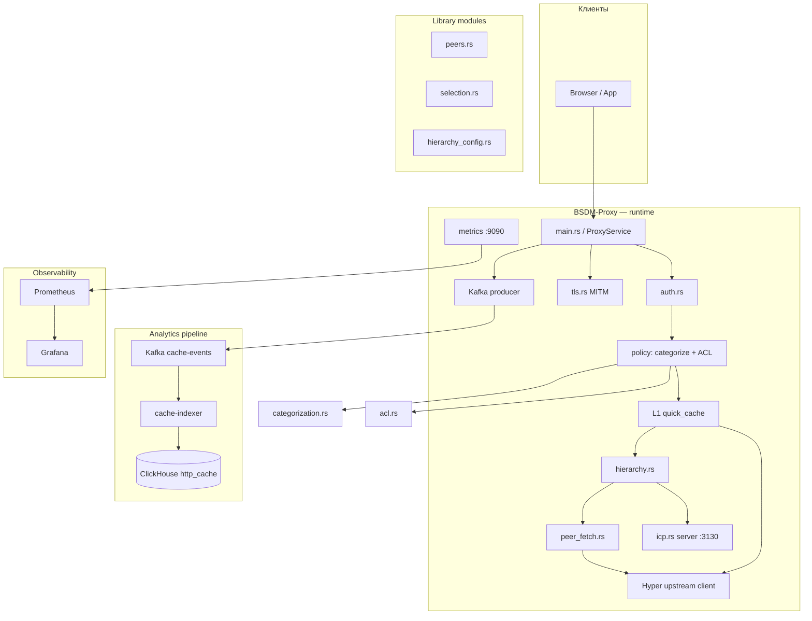
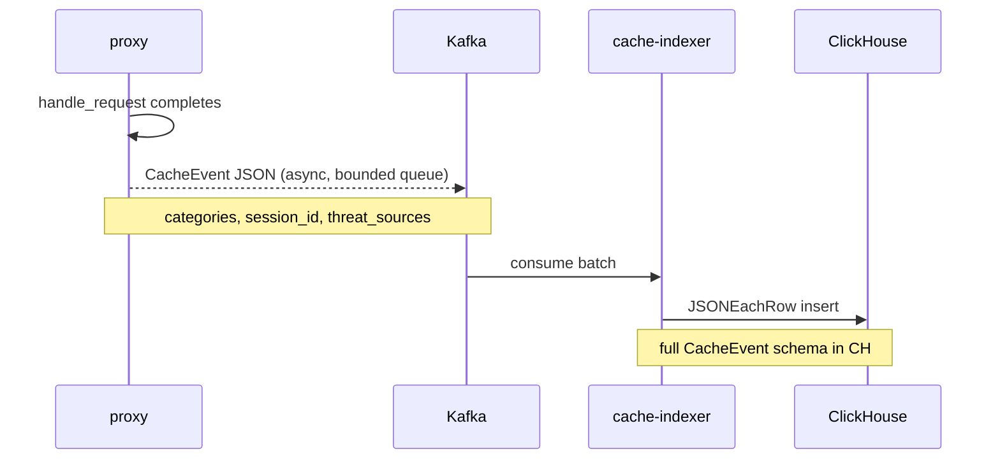
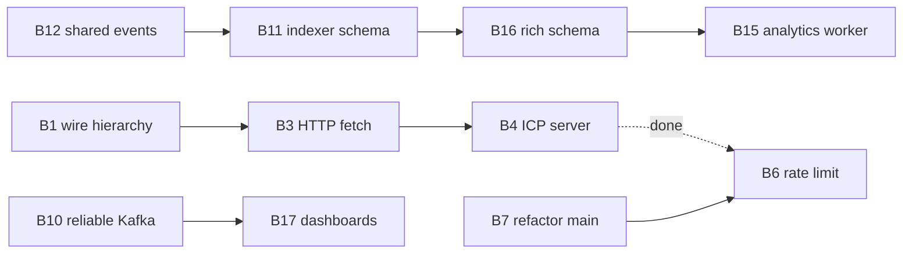

# Архитектура BSDM-Proxy

Документ описывает текущую архитектуру, потоки данных и **блокеры** на пути к целевому состоянию:

> Альтернатива Squid с ретропоиском и ML для выявления отклонений, фишинга и C&C

См. также: [roadmap.md](roadmap.md) · [development.md](development.md) · [deployment.md](deployment.md) · [docker.md](docker.md)

---

## Обзор компонентов



| Компонент | Crate / файл | В production |
|-----------|--------------|--------------|
| Proxy binary | `proxy/src/main.rs` | ✅ |
| Policy library | `proxy/src/lib.rs` — `acl`, `auth`, `categorization` | ✅ |
| MITM | `proxy/src/tls.rs` | ✅ |
| Hierarchy / ICP | `hierarchy.rs`, `peer_fetch.rs`, `icp.rs`, `hierarchy_config.rs` | ✅ opt-in (`HIERARCHY_ENABLED`) |
| Event indexer | `cache-indexer` | ✅ Kafka→CH or Lite HTTP→SQLite |
| Control plane | `control_api.rs` (:9090) | ✅ stats / purge / hierarchy / TLS |
| ML / analytics worker | `ml-worker` (:8091) | ✅ M5.1–M5.5 (UEBA / phishing / C&C / write-back) |
| Admin UI | `admin-console/` | ✅ React SPA |

---

## Поток запроса (request path)

```
TCP accept
  → HTTP/1.1 parse
  → CONNECT? → [MITM TLS | raw tunnel]
  → authenticate_proxy()          # Proxy-Authorization
  → rate_limit (IP / user / API key)
  → check_policy()
       → categorization.categorize()   # UT1 Blacklists / OTX / custom
       → acl_engine.check_access()     # ArcSwap snapshot (lock-free read)
       → threat_score_cache.lookup()   # M5.5 opt-in O(1) ML score (async poll)
  → [optional] LLM exact / semantic near-hit (POST chat/completions)
  → L1 cache lookup (GET/HEAD) → Redis L2 (opt)
  → [if miss coalesce] singleflight waiters → COALESCED-HIT
  → [if HIERARCHY_ENABLED] resolve_source()
       → ICP query siblings (parallel UDP)
       → select parent (round-robin / weighted / closest / hash)
       → fetch_via_peer() on SiblingHit / ParentHit
  → upstream HTTP request (origin fallback)
  → cache insert + response
  → emit event (Kafka | EVENT_SINK_URL HTTP | noop)
```

**Ключевые файлы:**

| Этап | Файл | Функция |
|------|------|---------|
| Entry | `main.rs`, `proxy_service.rs` | `handle_connection`, `handle_request` |
| Auth | `auth.rs` | `AuthManager::authenticate` |
| Policy | `proxy_service.rs` | `ProxyService::check_policy` |
| LLM cache | `semantic_cache.rs` | exact body-hash + optional near-hit |
| Coalesce | `miss_coalesce.rs` | singleflight MISS |
| Cache | `proxy_service.rs`, `cache_key.rs` | `http_cache`, `http_cache_key` |
| Hierarchy | `hierarchy.rs`, `hierarchy_config.rs` | `resolve_source`, env loading |
| Peer fetch | `peer_fetch.rs` | `fetch_via_peer` |
| ICP | `icp.rs`, `main.rs` | `IcpServer::serve`, `IcpClient::query_peers` |
| Upstream | `main.rs` | `build_upstream_https_connector`, `http_client` |
| MITM | `tls.rs`, `main.rs` | `handle_connect_mitm`, `CertCache` |

### Ограничения request path

- Hot path: L1 → (optional policy) → upstream; Kafka enqueue is non-blocking (bounded queue)
- Online threat feeds (URLhaus/PhishTank) — **async** enrich only (`categorize_local` on hot path)
- ACL uses `AclEngineHandle` (`arc-swap`) — no `RwLock` on hot-path checks
- Soft `session_id` is per-proxy-node (not shared across replicas)
- Hierarchy metrics (`bsdm_proxy_hierarchy_*`) при `HIERARCHY_ENABLED=true`

---

## Поток данных (analytics path)

```
CacheEvent (proxy_service / pipeline)
  → Kafka topic cache-events (env KAFKA_*, bounded queue)
     OR POST EVENT_SINK_URL (Lite)
  → cache-indexer (Kafka consumer | /api/events)
  → ClickHouse INSERT `bsdm.http_cache`  OR  SQLite / memory
```



**Поля `CacheEvent` (proxy):** url, method, status, cache_key, cache_status, user, client_ip, domain, timing, UA, content_type, **categories**

**Поля indexer:** полная схема `CacheEvent` в ClickHouse (`categories`, `threat_sources`, `acl_action`).

---

## Карта модулей

```
proxy/
├── src/
│   ├── main.rs          ← startup, listeners, ICP/HTCP/discovery spawn
│   ├── proxy_service.rs ← request path: auth → RL → policy → L1/L2 → coalesce/semantic → upstream
│   ├── control_api.rs   ← DX REST: /api/stats, purge, hierarchy, upstream TLS
│   ├── miss_coalesce.rs ← singleflight GET/HEAD MISS
│   ├── semantic_cache.rs← LLM POST body-hash + local similarity index
│   ├── threat_score_cache.rs ← M5.5 async poll + O(1) lookup
│   ├── tag_index.rs     ← Cache-Tag / Surrogate-Key purge index
│   ├── hierarchy.rs / hierarchy_config.rs / peer_fetch.rs / peers.rs / icp.rs / htcp.rs
│   ├── cache_key.rs, tls.rs, metrics.rs, rate_limit.rs, upstream.rs
│   └── lib.rs           ← module re-exports
cache-indexer/
└── src/                 ← Kafka|HTTP events → ClickHouse|SQLite|memory + Search API
ml-worker/               ← M5 feature store + scores + threat-score API
alert-worker/            ← M4 webhook alerts
admin-console/           ← React admin UI
e2e/                     ← smoke + E2E harness
```

### Hierarchy (интегрирована, opt-in)

Flow при `HIERARCHY_ENABLED=true`:

```
Local L1 miss → ICP query siblings → select parent → fetch_via_peer → origin fallback
```

Локальный ICP-сервер отвечает HIT/MISS по наличию URL в `http_cache` (ключ `GET:<url>`).

**Ограничения после Phase 4:** нет mTLS между peers, `HIERARCHY_DIRECT_DOMAINS`.

---

## Блокеры

Идентификаторы **B1–B25** — GitHub Issues [#32–#56](https://github.com/onixus/bsdm-proxy/issues?q=is%3Aissue+in%3Atitle+B).

Чеклист: [BLOCKERS.md](BLOCKERS.md) · *(bootstrap script archived: `scripts/archive/`)*

### 🔴 Critical — M1 Foundation

| ID | Блокер | Статус | Файлы |
|----|--------|--------|-------|
| **B1** | Hierarchy modules не в бинарнике | ✅ Done | `lib.rs` |
| **B2** | `rand` отсутствует в Cargo.toml | ✅ Done | `Cargo.toml` |
| **B3** | Hierarchy без HTTP fetch к peer | ✅ Done | `peer_fetch.rs`, `main.rs` |
| **B4** | ICP server не запускается | ✅ Done | `icp.rs`, `main.rs` |
| **B5** | `ca.key` обязателен при старте | ✅ Done | `tls.rs` |
| **B6** | Rate limiting | ✅ Done | `rate_limit.rs` (IP / user / API key) |

### 🟠 High — M2 Squid parity / M3 Retro-search

| ID | Блокер | Файлы | Milestone |
|----|--------|-------|-----------|
| **B7** | Монолит `main.rs` → ProxyService | ✅ Done | `proxy_service.rs` |
| **B8** | Online categorization off hot path | ✅ Done | `categorization.rs` (#104) |
| **B9** | ACL lock-free snapshot | ✅ Done | `acl.rs` |
| **B10** | Kafka topic env + acks + queue | ✅ Done | `pipeline.rs` |
| **B11** | Schema drift: `categories` в indexer | ✅ Done | `cache-indexer/src/main.rs` | M3 |
| **B12** | Shared `bsdm-events` crate | ✅ Done | `bsdm-events/` |
| **B13** | NTLM / Kerberos | ✅ Done | `auth.rs` |
| **B14** | ACL TimeWindow + group rules — реализовано | `acl.rs` | M2 ✅ |

### 🟡 Medium — M4 Threat / M5 ML

| ID | Блокер | Описание | Milestone |
|----|--------|----------|-----------|
| **B15** | Analytics/ML worker | ✅ M5.1–M5.5 (`ml-worker` + CH feature store + write-back) | M5 |
| **B16** | Event schema for analytics | ✅ Done (`session_id`, `acl_action`, `threat_sources`) | M3–M4 |
| **B17** | Analytics UI in compose | ✅ Done (Grafana + ClickHouse; OS Dashboards removed) | M3 |
| **B18** | Behavioral / beacon signals | ✅ Done (`beacon_periodic` in alert-worker) | M4 |
| **B19** | Alerting pipeline | ✅ Done (`alert-worker` → webhook + Grafana/AM) | M4 |
| **B20** | Historical threat analytics UI | ✅ Done (CH threat/beacon/Shannon panels + Unified Alerting) | M4 |

### 🔵 Structural — технический долг

| ID | Блокер | Файлы |
|----|--------|-------|
| **B21** | Feature flags | ✅ `kafka` feature (Lite: `--no-default-features`) | `Cargo.toml` |
| **B22** | Negative caching + `Cache-Control` revalidate | `cache_freshness.rs`, `proxy_service.rs` | ✅ |
| **B23** | HTTP/2 upstream — `UPSTREAM_HTTP2_ENABLED` | `upstream.rs` | ✅ |
| **B24** | Healthcheck curl vs wget — исправлено (`wget` в compose) | `docker-compose.yml`, `Dockerfile` |
| **B25** | REST ACL API на metrics port | `acl_api.rs`, `server.rs` | ✅ |
| **B26** | Dockerfile: workspace `e2e`, Rust stable | `Dockerfile` | ✅ |

---

## Блокеры по milestones

```
M1  ██████████████  B1–B6 ✅
M2  ██████████████  B7–B9 B13–B14 B21–B25 ✅
M3  █████████████░  B10–B12 B17 ✅ · B20 ✅
M4  ██████████████  B16 ✅ · B18 ✅ · B19 ✅ · B20 ✅
M5  ██████████████  B15 ✅ · M5.1–M5.5 (UEBA / phishing / C&C / write-back)
```

---

## Приоритет разблокировки

### Волны 1–2 — M1/M2/M3

Critical/high блокеры B1–B14, B17, B22–B26 — **закрыты**. Analytics path: ClickHouse.

### Волна 3 — M4/M5 foundation

1. ~~**B16** — rich event schema~~ ✅ (`session_id`, `acl_action`, `threat_sources`)
2. ~~**B15** — analytics / ML worker~~ ✅ (`ml-worker`, ADR 0003; M5.1–M5.5)
3. ~~**B18** — behavioral / beacon signals~~ ✅ (`beacon_periodic`)
4. ~~**B19** — SIEM webhook~~ ✅ (`alert-worker`)
5. ~~**B8** — online categorization off hot path~~ ✅ (#104)

---

## Зависимости между блокерами



---

## Критерии «архитектура здорова»

| Milestone | Архитектурный критерий |
|-----------|------------------------|
| **M1** | Hierarchy в request path ✅, rate limit, proxy стартует без CA при MITM=off ✅ |
| **M2** | `ProxyService` в lib, L2 Redis, ACL complete |
| **M3** | Единая event schema, indexer parity, Dashboards, Kafka acks≥1 |
| **M4** | Analytics worker, alerting, extended schema |
| **M5** | ML pipeline отдельно от hot path proxy |

---

*Версия документа: 0.5.0 · M1–M5 done · DX/AI prep (control plane, coalescing, LLM cache)*
