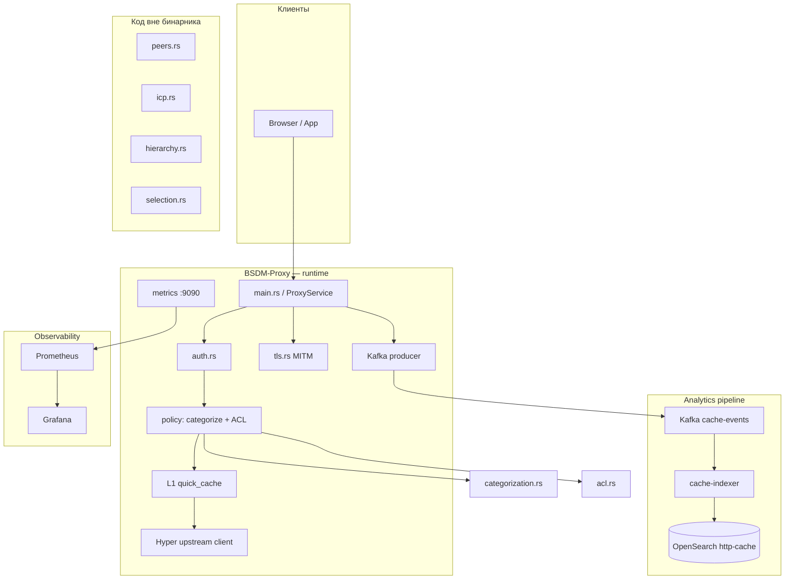
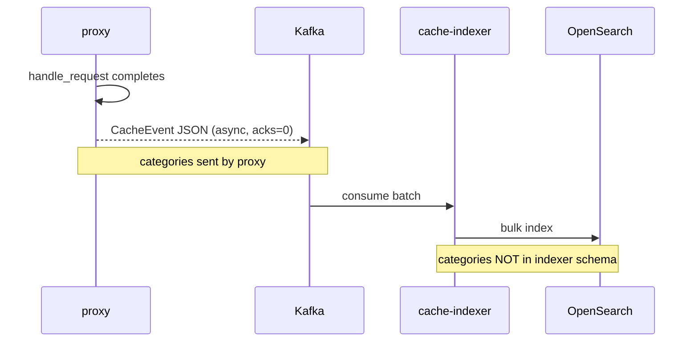
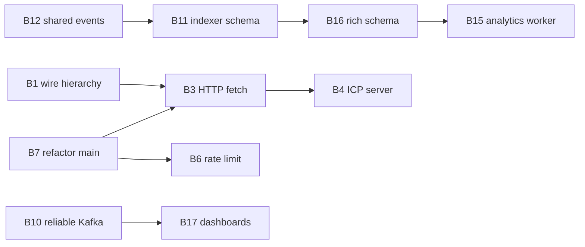

# Архитектура BSDM-Proxy

Документ описывает текущую архитектуру, потоки данных и **блокеры** на пути к целевому состоянию:

> Альтернатива Squid с ретропоиском и ML для выявления отклонений, фишинга и C&C

См. также: [roadmap.md](roadmap.md) · [development.md](development.md)

---

## Обзор компонентов



| Компонент | Crate / файл | В production |
|-----------|--------------|--------------|
| Proxy binary | `proxy/src/main.rs` | ✅ |
| Policy library | `proxy/src/lib.rs` — `acl`, `auth`, `categorization` | ✅ |
| MITM | `proxy/src/tls.rs` | ✅ |
| Hierarchy / ICP | `peers.rs`, `icp.rs`, `hierarchy.rs`, `selection.rs` | ❌ не подключены |
| Event indexer | `cache-indexer/src/main.rs` | ✅ |
| ML / analytics worker | — | ❌ не существует |

---

## Поток запроса (request path)

```
TCP accept
  → HTTP/1.1 parse
  → CONNECT? → [MITM TLS | raw tunnel]
  → authenticate_proxy()          # Proxy-Authorization
  → check_policy()
       → categorization.categorize()   # Shallalist / URLhaus / PhishTank
       → acl_engine.check_access()     # Mutex lock
  → L1 cache lookup (GET/HEAD)
  → upstream HTTP request
  → cache insert + response
  → send_to_kafka_async()         # fire-and-forget
```

**Ключевые файлы:**

| Этап | Файл | Функция |
|------|------|---------|
| Entry | `main.rs` | `handle_connection`, `handle_request` |
| Auth | `auth.rs` | `AuthManager::authenticate` |
| Policy | `main.rs` | `ProxyService::check_policy` |
| Cache | `main.rs` | `http_cache`, `generate_cache_key` |
| Upstream | `main.rs` | `build_upstream_https_connector`, `http_client` |
| MITM | `tls.rs`, `main.rs` | `handle_connect_mitm`, `CertCache` |

### Ограничения request path

- Вся логика в **binary crate** (`main.rs` ~1300 строк) — `ProxyService` не в `lib.rs`
- Categorization с online API на **критическом пути** каждого запроса
- ACL под глобальным `Mutex` — serializes concurrent ACL checks
- Hierarchy **не участвует** в выборе источника ответа

---

## Поток данных (analytics path)

```
CacheEvent (main.rs)
  → Kafka topic "cache-events" (hardcoded, acks=0)
  → cache-indexer consumer
  → OpenSearch bulk index "http-cache"
```



**Поля `CacheEvent` (proxy):** url, method, status, cache_key, cache_status, user, client_ip, domain, timing, UA, content_type, **categories**

**Поля indexer:** те же, кроме **categories** — теряются при десериализации.

---

## Карта модулей

```
proxy/
├── src/
│   ├── main.rs          ← монолит: ProxyService, cache, Kafka, HTTP server
│   ├── lib.rs           ← acl, auth, categorization (exported)
│   ├── tls.rs           ← MITM cert cache
│   ├── metrics.rs       ← Prometheus
│   ├── policy_config.rs ← env loading
│   ├── auth_config.rs
│   ├── peers.rs         ← ORPHAN (not mod)
│   ├── icp.rs           ← ORPHAN
│   ├── hierarchy.rs     ← ORPHAN
│   └── selection.rs     ← ORPHAN (uses rand, not in Cargo.toml)
cache-indexer/
└── src/main.rs          ← Kafka → OpenSearch
e2e/                     ← smoke + E2E harness
```

### Hierarchy (не интегрирована)

Задуманный flow (`hierarchy.rs`):

```
Local L1 miss → ICP query siblings → select parent → ??? → origin
```

**Пробел:** `resolve_source()` возвращает `SiblingHit` / `ParentHit`, но **нет HTTP fetch** с выбранного peer. `IcpServer` не стартует в `main.rs`.

---

## Блокеры

Идентификаторы **B1–B25** — GitHub Issues [#32–#56](https://github.com/onixus/bsdm-proxy/issues?q=is%3Aissue+in%3Atitle+B).

Чеклист: [BLOCKERS.md](BLOCKERS.md) · Создать заново: `./scripts/create-blocker-issues.sh`

### 🔴 Critical — M1 Foundation

| ID | Блокер | Файлы | Решение |
|----|--------|-------|---------|
| **B1** | Hierarchy modules не в бинарнике | `lib.rs`, `peers.rs`, `icp.rs`, `hierarchy.rs`, `selection.rs` | Добавить `mod`, экспорт, тесты в CI |
| **B2** | `rand` отсутствует в Cargo.toml | `selection.rs:84`, `Cargo.toml` | Добавить `rand = "0.8"` |
| **B3** | Hierarchy без HTTP fetch к peer | `hierarchy.rs` | После `ParentHit` — proxy HTTP GET к peer |
| **B4** | ICP server не запускается | `icp.rs`, `main.rs` | Spawn `IcpServer` при `HIERARCHY_ENABLED` |
| **B5** | `ca.key` обязателен при старте | `main.rs:858` | Optional при `MITM_ENABLED=false` |
| **B6** | Rate limiting отсутствует | `main.rs` | Token bucket per IP/user |

### 🟠 High — M2 Squid parity / M3 Retro-search

| ID | Блокер | Файлы | Milestone |
|----|--------|-------|-----------|
| **B7** | Монолит `main.rs` | `main.rs` | M1–M2 |
| **B8** | Categorization на hot path (external HTTP) | `categorization.rs`, `main.rs` | M2 |
| **B9** | ACL под `Mutex` | `policy_config.rs`, `main.rs` | M2 |
| **B10** | Kafka `acks=0`, topic hardcoded | `main.rs:361-365` | M3 |
| **B11** | Schema drift: `categories` не в indexer | `cache-indexer/src/main.rs` | M3 |
| **B12** | Нет shared event crate | `proxy`, `cache-indexer` | M3 |
| **B13** | NTLM — заглушка | `auth.rs:231` | M2 |
| **B14** | ACL: TimeWindow TODO, groups ignored | `acl.rs:224-236` | M2 |

### 🟡 Medium — M4 Threat / M5 ML

| ID | Блокер | Описание | Milestone |
|----|--------|----------|-----------|
| **B15** | Нет analytics/ML сервиса | Нужен worker для scoring, alerts | M4–M5 |
| **B16** | Бедная event schema | Нет session_id, acl_action, threat_score | M4 |
| **B17** | OpenSearch Dashboards не в стеке | `docker-compose.yml` | M3 |
| **B18** | Только URL-level threat | Нет DNS/timing/beacon signals | M4–M5 |
| **B19** | Нет alerting pipeline | OS Alerting / webhook / SIEM | M4 |
| **B20** | Grafana ≠ security analytics | Prometheus only, не historical threats | M3–M4 |

### 🔵 Structural — технический долг

| ID | Блокер | Файлы |
|----|--------|-------|
| **B21** | Feature flags не в main | `Cargo.toml` features |
| **B22** | Нет negative caching / refresh | `main.rs` |
| **B23** | HTTP/1 only upstream | `build_upstream_https_connector` |
| **B24** | Healthcheck curl vs wget | `docker-compose.yml`, `Dockerfile` |
| **B25** | REST ACL API документирован, не реализован | `docs/acl.md`, `main.rs` metrics server |

---

## Блокеры по milestones

```
M1  ████████████░░  B1 B2 B3 B4 B5 B6 B7
M2  ██████████████  B7 B8 B9 B13 B14 B21 B22 B23 B25 + B1–B4
M3  ████████████░░  B10 B11 B12 B17 B20
M4  ██████████████  B15 B16 B18 B19 + M3
M5  ██████████████  B15 B16 B18 + M4
```

---

## Приоритет разблокировки

### Волна 1 — разблокировать M1

1. **B5** — optional CA при `MITM_ENABLED=false` (quick win)
2. **B1 + B2** — подключить hierarchy modules + `rand`
3. **B3 + B4** — HTTP fetch к peer + ICP server
4. **B6** — rate limiting
5. **B7** — начать вынос `ProxyService` в `lib.rs`

### Волна 2 — разблокировать M3 (параллельно)

1. **B12** — crate `bsdm-events` с общей схемой
2. **B11** — indexer принимает `categories`, `acl_action`
3. **B10** — `KAFKA_TOPIC` env, `acks=1`
4. **B17** — OpenSearch Dashboards в compose

### Волна 3 — M4/M5 foundation

1. **B16** — расширить schema (session_id, threat_score)
2. **B15** — analytics worker (отдельный crate или Python sidecar)
3. **B8** — вынести online categorization с hot path

---

## Зависимости между блокерами



---

## Критерии «архитектура здорова»

| Milestone | Архитектурный критерий |
|-----------|------------------------|
| **M1** | Hierarchy в request path, rate limit, proxy стартует без CA при MITM=off |
| **M2** | `ProxyService` в lib, L2 Redis, ACL complete |
| **M3** | Единая event schema, indexer parity, Dashboards, Kafka acks≥1 |
| **M4** | Analytics worker, alerting, extended schema |
| **M5** | ML pipeline отдельно от hot path proxy |

---

*Версия документа: 0.2.2b · блокеры B1–B25*
