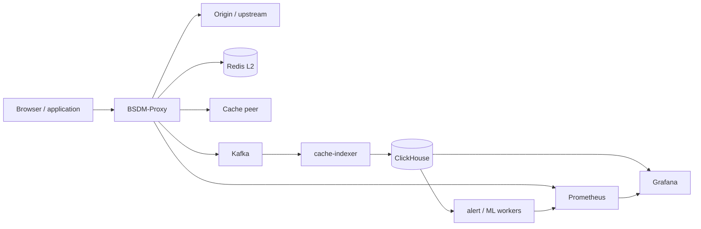
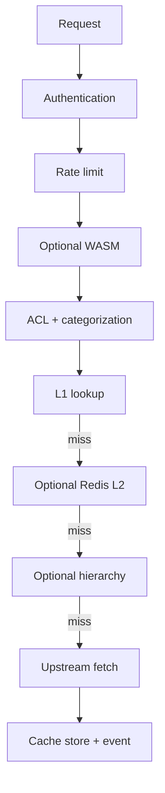

# Архитектура BSDM-Proxy

Этот документ описывает фактические компоненты и потоки версии `0.6.1-1`.
Зрелость функций указана отдельно в [Project status](../project-status.md).

## Системный контекст



Redis, peers, workers и часть monitoring stack являются опциональными.

## Request path

Упрощённый HTTP/MITM path:



`PERF_FAST_CACHE_HIT` меняет порядок для cache hits и может пропустить policy
checks. Это bench-флаг, а не production default.

CONNECT работает в двух режимах:

- без MITM — двунаправленный TCP tunnel;
- с MITM — TLS завершается на proxy, затем HTTP request проходит через обычный path.

## Компоненты

| Компонент | Реализация | Назначение |
|---|---|---|
| proxy | `proxy/` | Data plane, cache, auth, policy, control API |
| cache-indexer | `cache-indexer/` | Kafka/HTTP ingest в ClickHouse или SQLite |
| bsdm-events | `bsdm-events/` | Общая event schema |
| alert-worker | `alert-worker/` | Periodic ClickHouse rules → webhook |
| ml-worker | `ml-worker/` | Feature extraction, scoring и write-back |
| dns-sinkhole | `dns-sinkhole/` | UDP DNS, DoH/DoT и RPZ-lite filtering |
| admin-console | `admin-console/` | Отдельно собираемая React SPA |
| monitoring | `prometheus/`, `grafana/`, `alertmanager/` | Metrics, dashboards и alerts |

## Proxy internals

| Область | Основные модули |
|---|---|
| Server / service | `main.rs`, `server.rs`, `proxy_service.rs` |
| TLS / upstream | `tls.rs`, `upstream.rs` |
| Cache | `cache.rs`, `sharded_cache.rs`, `cache_body.rs`, `l2_cache.rs` |
| Policy | `auth.rs`, `acl.rs`, `categorization.rs`, `rate_limit.rs` |
| Hierarchy | `hierarchy.rs`, `peer_fetch.rs`, `icp.rs`, `htcp.rs` |
| Events | `pipeline.rs`, `bsdm-events/` |
| Control | `control_api.rs`, `acl_api.rs`, `control_grpc.rs` |
| Optional | `semantic_cache.rs`, `wasm_host.rs`, `icap.rs`, `ebpf.rs` |
| Experimental | `dlp.rs`, `casb.rs`, `reverse_proxy.rs`, `amneziawg.rs`, `session_store.rs`, `threat_sync.rs` |

## Cache architecture

Lookup order:

```text
L1 → Redis L2 → sibling/parent → origin
```

L1:

- `HttpL1Cache` делит общую `CACHE_CAPACITY` между power-of-two shards;
- небольшие тела хранятся inline;
- тела выше `CACHE_SPILL_THRESHOLD_BYTES` записываются в mmap spill;
- cache freshness учитывает TTL, Cache-Control, validators и negative cache;
- miss coalescing объединяет параллельные запросы одного ключа.

Hierarchy и Redis включаются независимо. Локальный spill не должен размещаться
на общем RWX volume.

## Analytics data flow

```text
proxy
  └─ CacheEvent
       └─ Kafka cache-events
            └─ cache-indexer batch
                 └─ ClickHouse bsdm.http_cache
                      ├─ Search API
                      ├─ Grafana
                      ├─ alert-worker
                      └─ ml-worker
```

Indexer пишет batch до 50 событий или по timeout. Один `ml-worker` выбирает одну
модель через `ML_MODEL`; несколько моделей требуют нескольких процессов.

В Lite mode proxy отправляет события по HTTP в SQLite indexer без Kafka и
ClickHouse.

## Control plane

REST control plane работает на metrics port proxy:

- health, readiness и metrics;
- stats и cache purge;
- ACL CRUD/reload;
- hierarchy и upstream TLS reload;
- optional WASM reload;
- DLP/CASB и AWG experimental state.
- experimental local cluster-session and threat-sync endpoints.

Mutating endpoints должны быть закрыты bearer token и network policy. gRPC
control plane компилируется отдельной feature.

## Deployment modes

| Режим | Состав | Назначение |
|---|---|---|
| Lite | proxy + SQLite indexer | Local/dev/edge |
| Analytics Compose | proxy + Kafka + ClickHouse + monitoring | Pilot |
| Helm | proxy и optional workers; external analytics допустим | Kubernetes |
| Native | systemd binaries + external dependencies | VM/bare metal |

Пилотный профиль: [100 пользователей](../getting-started/pilot-deployment.md).

## Trust boundaries

- CA private key — критический секрет, доступный только proxy.
- Proxy client network не должен иметь доступ к Kafka, ClickHouse и Redis.
- Control, Search API, Grafana и metrics требуют аутентификации или сетевого
  ограничения.
- Kafka/ClickHouse transport в Compose не является защищённым production
  perimeter.
- Experimental OIDC, DLP, eBPF, AWG и cluster-sync integration не должны
  считаться готовой security boundary.

## Связанные документы

- [Configuration](../ops-and-dev/configuration.md)
- [Capacity planning](capacity-planning.md)
- [Performance](performance.md)
- [Hierarchy](hierarchical-caching.md)
- [ClickHouse](../analytics/clickhouse-retrosearch.md)
- [Project status](../project-status.md)
