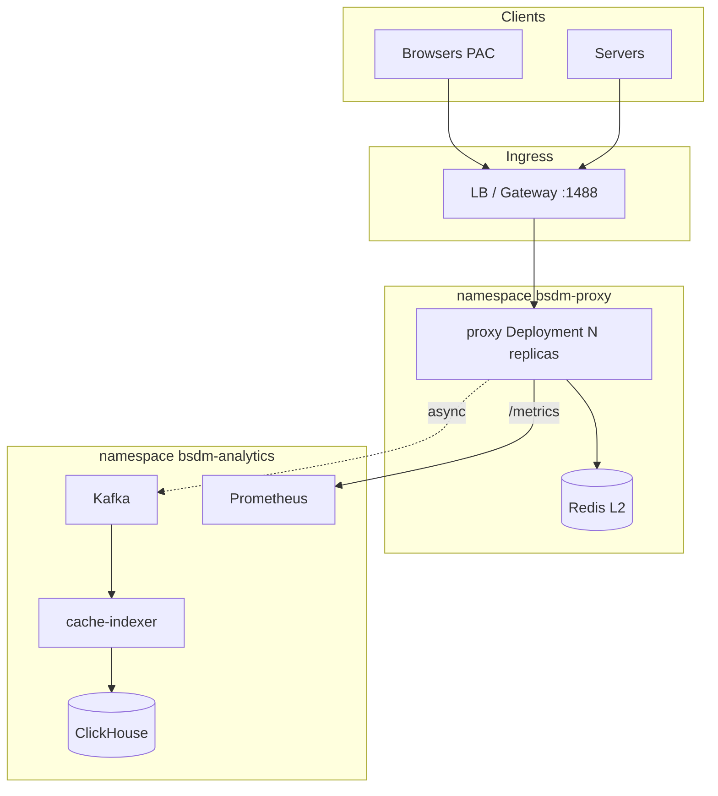
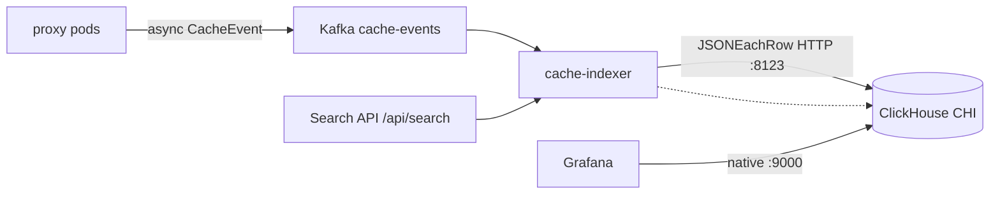

# BSDM-Proxy on Kubernetes

Рекомендуемая архитектура развёртывания BSDM на Kubernetes: data plane (proxy + Redis L2) и analytics plane (Kafka → indexer → ClickHouse).

См. также: [capacity-planning.md](capacity-planning.md) · [swg-backlog-mapping.md](swg-backlog-mapping.md) · [helm chart](../charts/bsdm/README.md)

---

## Принципы

| Принцип | Обоснование |
|---------|-------------|
| Горизонтальный scale proxy pods | Bench: `WORKER_COUNT=4` + shared L1 хуже, чем N реплик с `WORKER_COUNT=1` |
| Redis L2 обязателен для HA | L1 локален; без L2 — sticky sessions и cache miss storm |
| Spill локальный per pod | mmap spill (`CACHE_SPILL_DIR`) не шарить через NFS |
| Analytics в отдельном namespace | Kafka/ClickHouse не конкурируют с proxy за CPU |
| `sessionAffinity: None` | Когерентность через L2, не через LB stickiness |

---

## Топология (corporate medium)



### Референс sizing (5k users, ~350 peak RPS)

| Компонент | K8s | Replicas | CPU/pod | RAM/pod |
|-----------|-----|----------|---------|---------|
| bsdm-proxy | Deployment | 4 | 4 req / 8 lim | 8 Gi / 16 Gi |
| Redis L2 | StatefulSet / Helm | 2+1 sentinel | 2 / 4 | 16 Gi / 32 Gi |
| cache-indexer | Deployment | 2 | 1 / 2 | 512 Mi / 1 Gi |
| Kafka | Strimzi / external | 3 | 2 / 4 | 8 Gi |
| ClickHouse | StatefulSet / managed / ClickHouse Cloud | 1–3 | 8 / 8 | 32 Gi |

Полные цифры: [capacity-planning.md](capacity-planning.md).

---

## Data plane: proxy Deployment

### Workload type

- **Deployment** (не StatefulSet) — pods взаимозаменяемы
- **RollingUpdate** + **PodDisruptionBudget** `minAvailable: 1`
- **Не использовать** `sessionAffinity: ClientIP`

### Рекомендуемый env (k8s-prod)

```bash
WORKER_COUNT=1
CACHE_SHARDS=16
CACHE_CAPACITY=25000              # per pod; 4× = 100k суммарно
CACHE_SPILL_DIR=/var/cache/bsdm-spill
CACHE_SPILL_THRESHOLD_BYTES=262144
REDIS_L2_ENABLED=true
REDIS_URL=redis://redis-master:6379
KAFKA_SAMPLE_RATE=10
METRICS_SAMPLE_RATE=100
SHUTDOWN_TIMEOUT_SECONDS=30
```

Corporate profile: `MAX_CACHE_BODY_SIZE=2097152`, `CACHE_COMPRESSION=zstd`, `CACHE_COMPRESS_MIN_BYTES=1048576`.

### Volumes

| Volume | Тип | Назначение |
|--------|-----|------------|
| `mitm-certs` | Secret | `ca.crt`, `ca.key` → `/certs` |
| `acl-rules` | ConfigMap | `/etc/bsdm-proxy/acl-rules.json` |
| `spill` | emptyDir (sizeLimit 30Gi) | mmap spill; prefer nodes with local SSD |
| `ut1-blacklists` | ConfigMap / initContainer | UT1 categorization DB |

### Probes

| Probe | Path | Port |
|-------|------|------|
| liveness | `/health` | 9090 |
| readiness | `/ready` | 9090 |
| startup | `/health` | 9090 (failureThreshold высокий) |

`lifecycle.preStop`: `sleep 15` + graceful shutdown в proxy.

### securityContext

```yaml
securityContext:
  runAsNonRoot: true
  runAsUser: 65532
  fsGroup: 65532
```

Spill files: `mode 0o600`, directory `0o700` (см. `ensure_private_spill_dir` в `cache_body.rs`, [#98](https://github.com/onixus/bsdm-proxy/issues/98)).

---

## Service & networking

```yaml
# bsdm-proxy — user traffic
ports:
  - name: proxy
    port: 1488
  - name: metrics
    port: 9090
sessionAffinity: None
```

| Трафик | Доступ |
|--------|--------|
| Proxy :1488 | Internal LB / ClusterIP из corporate CIDR |
| Metrics :9090 | NetworkPolicy: только `monitoring` namespace |
| ACL API `/api/acl/*` | Тот же :9090 + `ACL_API_TOKEN` |

**NetworkPolicy (минимум):**
- Ingress → proxy:1488 from `corporate` CIDR
- Egress: internet :80/:443, Redis, Kafka, LDAP
- Deny all else

---

## Redis L2

Обязателен при `replicas > 1`.

| Вариант | Когда |
|---------|-------|
| Bitnami Redis + Sentinel (subchart) | on-prem k8s, lab |
| Redis Cluster | >100k L2 keys |
| Managed (ElastiCache, Azure) | cloud k8s |

Поведение: pod-A кеширует MISS → L1+L2 → pod-B после restart получает **L2-HIT**.

Демо без k8s: `docker compose -f docker-compose.redis-l2.yml`.

---

## Analytics plane (`bsdm-analytics` namespace)



| Компонент | Назначение |
|-----------|------------|
| Kafka topic `cache-events` | 12 partitions, RF=3, retention 7d |
| cache-indexer | Consumer group → ClickHouse; HPA по lag |
| **ClickHouse** (Operator / managed) | Table `bsdm.http_cache`, TTL 42d |
| Prometheus + Grafana | Proxy metrics + CH SQL dashboards |

**OpenSearch не требуется** — analytics path только ClickHouse ([ADR 0002](adr/0002-clickhouse-analytics.md), epic [#125](https://github.com/onixus/bsdm-proxy/issues/125)).

Proxy **не должен** блокироваться на Kafka (bounded queue, drop-new).

### ClickHouse Operator (Altinity)

Рекомендуемый on-prem путь — [Altinity ClickHouse Operator](https://github.com/Altinity/clickhouse-operator):

```bash
helm repo add altinity https://docs.altinity.com/clickhouse-operator/
helm install clickhouse-operator altinity/altinity-clickhouse-operator \
  -n clickhouse-operator --create-namespace

kubectl create namespace bsdm-analytics
kubectl apply -f charts/bsdm/examples/clickhouse-installation.yaml
```

Пример CR: [`charts/bsdm/examples/clickhouse-installation.yaml`](../charts/bsdm/examples/clickhouse-installation.yaml) — 1 shard / 1 replica, PVC **100Gi** (Retain).

Альтернативы: ClickHouse Cloud, managed DB, или plain StatefulSet (lab only).

#### Endpoints

| Protocol | Service (CHI `bsdm`) | Client |
|----------|----------------------|--------|
| HTTP `:8123` | `clickhouse-bsdm.bsdm-analytics.svc` | cache-indexer |
| Native `:9000` | same | Grafana `grafana-clickhouse-datasource` |

Init schema once:

```bash
kubectl -n bsdm-analytics exec -i chi-bsdm-bsdm-0-0-0 -- \
  clickhouse-client --multiquery < scripts/clickhouse/http_cache.sql
```

Session columns on existing volumes: `scripts/clickhouse/migrations/001_session_correlation.sql`.

### Helm: cache-indexer → external CH

```bash
# Indexer-only release in analytics namespace
helm upgrade --install bsdm-indexer ./charts/bsdm \
  -f charts/bsdm/values-analytics.yaml \
  -n bsdm-analytics --create-namespace
```

| Value | Purpose |
|-------|---------|
| `indexer.enabled` | Deploy cache-indexer Deployment + Service `:8080` |
| `indexer.clickhouse.url` | HTTP URL of CHI / managed CH |
| `indexer.clickhouse.existingSecret` | Optional Secret keys `username` / `password` |
| `replicaCount: 0` | Skip proxy templates when installing indexer-only |

Proxy Kafka brokers (data plane): `proxy.kafkaBrokers` in `values-prod.yaml` → `kafka-bootstrap.bsdm-analytics.svc:9092`.

### Sizing storage (vs OpenSearch)

| | OpenSearch (legacy) | ClickHouse `http_cache` |
|--|---------------------|-------------------------|
| Guidance | ~64Gi StatefulSet | start **100Gi** PVC, grow with retention |
| Retention | ISM ~42d | MergeTree **TTL 42 DAY** |
| Compression | Lucene | columnar + TTL delete |

Для SOC-объёмов (корпоративный medium) 100Gi обычно достаточно на 42 дня компактных `CacheEvent`; увеличивайте PVC / shards при sample rate 1 или длинном retention.

### Backup / DR

| Метод | Когда |
|-------|--------|
| `FREEZE PARTITION` + volume snapshot | on-prem CHI / StatefulSet |
| ClickHouse Cloud / managed backups | cloud |
| S3 `BACKUP` / `RESTORE` (CH 22+) | cross-region DR |
| Kafka retention 7d | replay-окно при потере fresh inserts |

Не полагайтесь на OpenSearch snapshots — их больше нет в product path.

### GitOps layout

```
gitops/
├── bsdm-proxy/              # Helm charts/bsdm + values-prod.yaml
├── bsdm-analytics/
│   ├── kafka/               # Strimzi / Bitnami
│   ├── clickhouse/          # Operator + CHI (examples/clickhouse-installation.yaml)
│   └── indexer/             # Helm -f values-analytics.yaml
└── secrets/                 # External Secrets → mitm-ca, CH user, SEARCH_API_TOKEN
```

---

## Autoscaling

**HPA** на proxy Deployment:

- CPU utilization 70%
- Custom: `bsdm_proxy_requests_total` rate (Prometheus Adapter)

**Не масштабировать** по memory L1 — фиксируйте `CACHE_CAPACITY` per pod, добавляйте replicas.

---

## Hierarchy (optional)

ICP/HTCP (UDP) в k8s сложен. Рекомендация на старте:

- `HIERARCHY_ENABLED=true`
- Parent fetch через internal Service
- ICP/HTCP: dedicated node pool + `hostNetwork: true` или отключить siblings

См. [hierarchical-caching.md](hierarchical-caching.md).

---

## Deployment profiles

### A. Edge (minimal)

```
bsdm-proxy (4 pods) + Redis Sentinel
Prometheus Agent → remote_write
Kafka external / small cluster
```

### B. Full stack

```
bsdm-proxy + Redis + Kafka + ClickHouse + indexer + Grafana
```

См. `docker-compose.yml` как reference stack; в k8s — разнести по namespace.

---

## GitOps layout

См. [Analytics plane](#analytics-plane-bsdm-analytics-namespace) — Kafka + ClickHouse Operator + indexer; OpenSearch не входит в layout.

| Артефакт | Источник |
|----------|----------|
| Env defaults | Helm `values.yaml` → ConfigMap |
| ACL rules | ConfigMap + `ACL_AUTO_RELOAD=true` |
| MITM CA | cert-manager Certificate → Secret |
| ClickHouse | Operator `ClickHouseInstallation` |
| Indexer | Helm `-f values-analytics.yaml` |

---

## Антипаттерны

| ❌ | ✅ |
|----|-----|
| 1 pod × WORKER_COUNT=4 × 32 CPU | 4 pods × WORKER_COUNT=1 |
| Shared PVC/NFS для spill | emptyDir local per pod |
| sessionAffinity для cache | Redis L2 |
| Kafka в том же pod | Отдельный namespace |
| MITM CA baked in image | Secret mount |

---

## Helm chart

Скелет: [`charts/bsdm/`](../charts/bsdm/README.md)

```bash
helm install bsdm ./charts/bsdm \
  -f charts/bsdm/values-prod.yaml \
  -n bsdm-proxy --create-namespace
```

---

## Backlog → k8s

| Issue | K8s impact |
|-------|------------|
| [#94](https://github.com/onixus/bsdm-proxy/issues/94) Streaming MISS | Lower memory limits per pod |
| [#95](https://github.com/onixus/bsdm-proxy/issues/95) Conn auth cache | Less LDAP load behind LB keep-alive |
| [#96](https://github.com/onixus/bsdm-proxy/issues/96) Policy cache | Lower CPU → fewer replicas |
| [#97](https://github.com/onixus/bsdm-proxy/issues/97) WORKER_COUNT profiles | `values-prod.yaml`: `workerCount: 1` |
| [#107](https://github.com/onixus/bsdm-proxy/issues/107) HA guide | This document |
| [#135](https://github.com/onixus/bsdm-proxy/issues/135) CH Operator analytics | CHI example + `values-analytics.yaml` |

---

*Последнее обновление: 2026-07 · BSDM v0.3.2 · M3 CH Operator (#135)*
