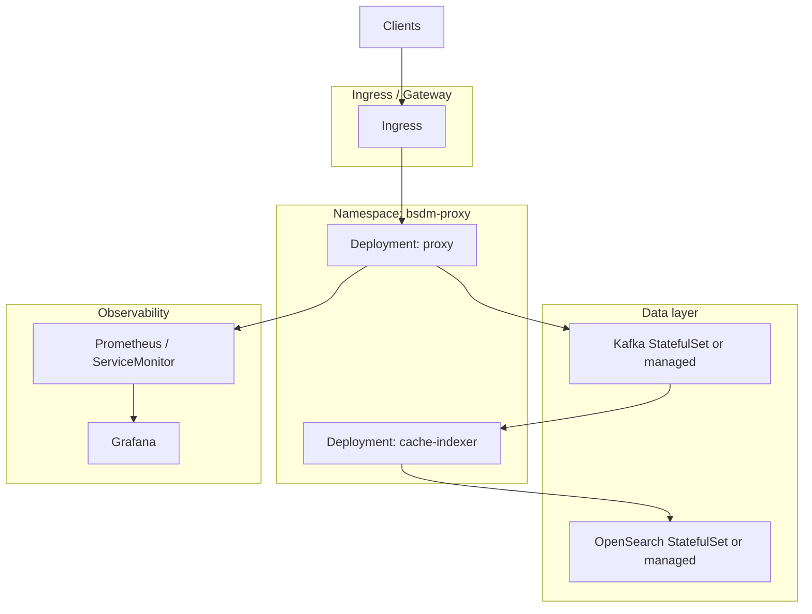

# Kubernetes

Руководство по развёртыванию BSDM-Proxy в Kubernetes.

> См. также: [deployment.md](deployment.md) · [docker.md](docker.md)

---

## Что даёт k8s, а что нет

| Проблема | Решит k8s? |
|----------|------------|
| Сеть между proxy, Kafka, OpenSearch | ✅ на кластере с рабочим CNI |
| Health checks, рестарты, rolling update | ✅ |
| Масштабирование proxy / cache-indexer | ✅ |
| Сборка Dockerfile / версия Rust | ❌ образы собираются отдельно (CI) |
| HTTPS-кэш без MITM | ❌ настройка приложения |
| Ограничения sandbox-хоста | ❌ нужен нормальный кластер |

**Рекомендация:** сначала стабилизируйте сборку образов и CI, затем деплой в k8s.

---

## Архитектура в кластере



---

## Минимальные манифесты (эскиз)

### ConfigMap (фрагмент)

```yaml
apiVersion: v1
kind: ConfigMap
metadata:
  name: bsdm-proxy-config
data:
  HTTP_PORT: "1488"
  METRICS_PORT: "9090"
  MITM_ENABLED: "true"
  KAFKA_BROKERS: "kafka:9092"
  KAFKA_TOPIC: "cache-events"
  OPENSEARCH_URL: "http://opensearch:9200"
  CACHE_CAPACITY: "10000"
  RUST_LOG: "info,bsdm_proxy=info"
```

### Secret (MITM CA)

```yaml
apiVersion: v1
kind: Secret
metadata:
  name: bsdm-proxy-ca
type: Opaque
stringData:
  ca.crt: |
    ...
  ca.key: |
    ...
```

Монтировать в `/certs/` (read-only).

### Deployment: proxy

```yaml
apiVersion: apps/v1
kind: Deployment
metadata:
  name: bsdm-proxy
spec:
  replicas: 2
  selector:
    matchLabels:
      app: bsdm-proxy
  template:
    metadata:
      labels:
        app: bsdm-proxy
    spec:
      containers:
        - name: proxy
          image: ghcr.io/onixus/bsdm-proxy:0.2.3test
          ports:
            - containerPort: 1488
              name: proxy
            - containerPort: 9090
              name: metrics
          envFrom:
            - configMapRef:
                name: bsdm-proxy-config
          volumeMounts:
            - name: ca
              mountPath: /certs
              readOnly: true
          readinessProbe:
            httpGet:
              path: /ready
              port: metrics
            initialDelaySeconds: 5
            periodSeconds: 10
          livenessProbe:
            httpGet:
              path: /health
              port: metrics
            initialDelaySeconds: 10
            periodSeconds: 30
      volumes:
        - name: ca
          secret:
            secretName: bsdm-proxy-ca
```

### Service

```yaml
apiVersion: v1
kind: Service
metadata:
  name: bsdm-proxy
spec:
  selector:
    app: bsdm-proxy
  ports:
    - name: proxy
      port: 1488
      targetPort: 1488
    - name: metrics
      port: 9090
      targetPort: 9090
```

### Deployment: cache-indexer

Аналогично proxy: без Service для клиентов, env `KAFKA_*`, `OPENSEARCH_*`, `depends` через readiness Kafka/OS.

---

## Managed vs in-cluster

| Компонент | In-cluster | Managed (рекомендация для прод) |
|-----------|------------|-----------------------------------|
| Kafka | StatefulSet + Strimzi/Confluent Operator | AWS MSK, Confluent Cloud |
| OpenSearch | StatefulSet | AWS OpenSearch, Elastic Cloud |
| Prometheus/Grafana | kube-prometheus-stack | Grafana Cloud |

---

## ServiceMonitor (Prometheus Operator)

```yaml
apiVersion: monitoring.coreos.com/v1
kind: ServiceMonitor
metadata:
  name: bsdm-proxy
spec:
  selector:
    matchLabels:
      app: bsdm-proxy
  endpoints:
    - port: metrics
      path: /metrics
      interval: 15s
```

---

## Graceful shutdown

Proxy поддерживает `SHUTDOWN_TIMEOUT_SECONDS` (default 30). При `kubectl delete pod` убедитесь, что `terminationGracePeriodSeconds` ≥ этого значения.

`/ready` возвращает `draining` во время shutdown — используйте как readiness probe.

---

## Иерархический кеш в k8s

Для `HIERARCHY_ENABLED=true`:

- ICP: UDP `3130` — нужен `Service` type NodePort или headless + hostNetwork (зависит от CNI).
- `CACHE_PARENTS` / `CACHE_SIBLINGS`: DNS-имена Service других proxy-реплик или отдельных tier Deployments.

Пример headless для ICP между peers:

```yaml
apiVersion: v1
kind: Service
metadata:
  name: bsdm-proxy-icp
spec:
  clusterIP: None
  ports:
    - port: 3130
      protocol: UDP
      name: icp
```

---

## CI/CD pipeline (рекомендуемый)

1. `cargo test --workspace --all-targets`
2. `docker build --target proxy -t $REGISTRY/bsdm-proxy:$TAG .`
3. `docker build --target cache-indexer -t $REGISTRY/cache-indexer:$TAG .`
4. Push → `kubectl set image` / Helm upgrade

---

## Helm (планируется)

Официальный Helm chart пока не в репозитории. До появления chart используйте Kustomize или raw manifests по шаблонам выше.

См. [roadmap.md](roadmap.md) — packaging/k8s в backlog M2.
