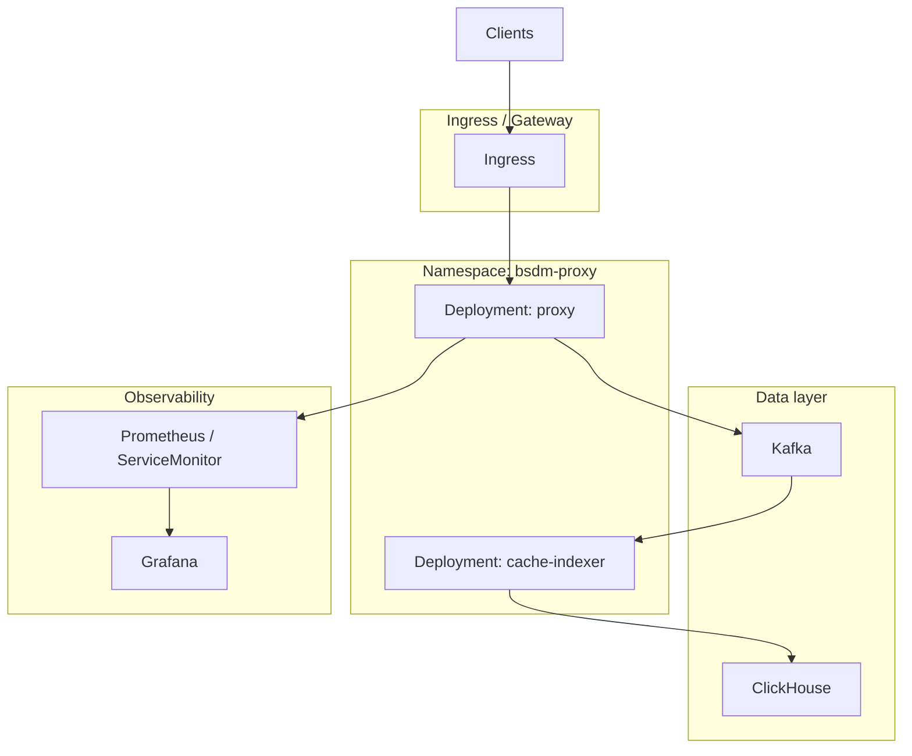

# Kubernetes

Руководство по развёртыванию BSDM-Proxy в Kubernetes.

> См. также: [deployment.md](deployment.md) · [k8s-architecture.md](k8s-architecture.md) · [charts/bsdm/README.md](../charts/bsdm/README.md)

---

## Что даёт k8s, а что нет

| Проблема | Решит k8s? |
|----------|------------|
| Сеть между proxy, Kafka, ClickHouse | ✅ на кластере с рабочим CNI |
| Health checks, рестарты, rolling update | ✅ |
| Масштабирование proxy / cache-indexer | ✅ |
| Сборка Dockerfile / версия Rust | ❌ образы собираются отдельно (CI) |
| HTTPS-кэш без MITM | ❌ настройка приложения |

---

## Helm chart (рекомендуется)

Официальный chart: `charts/bsdm/`

```bash
# MITM CA (если mitm.enabled)
kubectl create secret generic bsdm-mitm-ca -n bsdm-proxy \
  --from-file=ca.crt=./certs/ca.crt \
  --from-file=ca.key=./certs/ca.key

helm install bsdm ./charts/bsdm -n bsdm-proxy --create-namespace \
  --set mitm.existingSecret=bsdm-mitm-ca

# Production profile
helm install bsdm ./charts/bsdm -f charts/bsdm/values-prod.yaml \
  -n bsdm-proxy --create-namespace
```

Шаблоны: Deployment, Service, HPA, PDB, NetworkPolicy, ServiceMonitor.

Полная архитектура: [k8s-architecture.md](k8s-architecture.md).

---

## Архитектура в кластере



---

## ConfigMap (фрагмент)

```yaml
apiVersion: v1
kind: ConfigMap
metadata:
  name: bsdm-proxy-config
data:
  HTTP_PORT: "1488"
  METRICS_PORT: "9090"
  MITM_ENABLED: "true"
  KAFKA_BROKERS: "kafka:9092"
  KAFKA_TOPIC: "cache-events"
  CLICKHOUSE_URL: "http://clickhouse:8123"
  CLICKHOUSE_DATABASE: "bsdm"
  CLICKHOUSE_TABLE: "http_cache"
  CACHE_CAPACITY: "10000"
  RUST_LOG: "info,bsdm_proxy=info"
```

---

## Probes

```yaml
readinessProbe:
  httpGet:
    path: /ready
    port: metrics
livenessProbe:
  httpGet:
    path: /health
    port: metrics
```

`/ready` возвращает `draining` при shutdown — `terminationGracePeriodSeconds` ≥ `SHUTDOWN_TIMEOUT_SECONDS` (default 30).

---

## Managed vs in-cluster

| Компонент | In-cluster | Managed |
|-----------|------------|---------|
| Kafka | Strimzi / Confluent Operator | AWS MSK, Confluent Cloud |
| ClickHouse | StatefulSet / Altinity operator | ClickHouse Cloud |
| Prometheus/Grafana | kube-prometheus-stack | Grafana Cloud |

---

## Иерархический кеш

Для `HIERARCHY_ENABLED=true`: UDP `3130` через headless Service или NodePort; `CACHE_PARENTS` / `CACHE_SIBLINGS` — DNS имён peer Deployments.

---

## CI/CD

1. `cargo test --workspace --all-targets`
2. `docker build --target proxy -t $REGISTRY/bsdm-proxy:$TAG .`
3. `docker build --target cache-indexer -t $REGISTRY/cache-indexer:$TAG .`
4. `helm upgrade --install bsdm ./charts/bsdm ...`

Release workflow: [development.md](development.md#github-release-ci).
