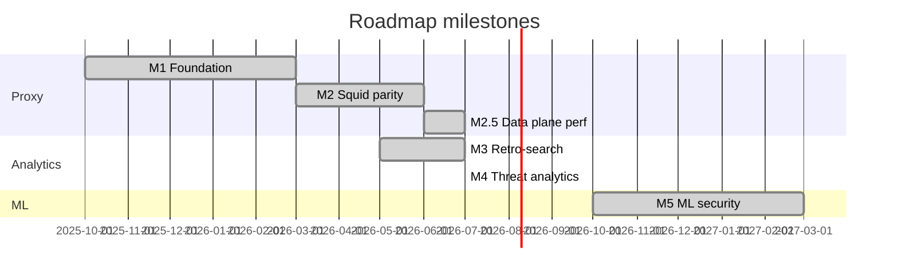

# Roadmap BSDM-Proxy

Целевое состояние проекта:

> **Альтернатива Squid с ретропоиском и ML для выявления отклонений, фишинга и C&C**

| Столп | Описание |
|-------|----------|
| **Squid parity** | Forward proxy, кеш, ACL, auth, иерархия, rate limiting |
| **Ретропоиск** | Поиск и аналитика по историческому HTTP-трафику |
| **ML-безопасность** | Аномалии, фишинг и C&C поверх логов и поведенческих сигналов |

Текущая версия: **0.5.0** · [Releases](https://github.com/onixus/bsdm-proxy/releases) · [CHANGELOG](../CHANGELOG.md)

Стратегический вектор (Lite → DX → Wasm → AI): **[strategic-roadmap.md](strategic-roadmap.md)**

---

## Обзор milestones

| Milestone | Версия | Фокус | Готовность |
|-----------|--------|-------|------------|
| [M1 — Foundation](#m1--foundation-v02x) | v0.2.x | Ядро прокси, ACL, observability | ✅ Done |
| [M2 — Squid parity](#m2--squid-parity-v03x) | v0.3.x | L2, ACL, hierarchy, auth, compression | ✅ Done |
| [M2.5 — Data plane](#m25--data-plane-throughput-v03x) | v0.3.x–0.3.2 | Tiered L1, streaming, P1 hot path | ✅ Done |
| [M3 — Retro-search](#m3--retro-search) | v0.3.1+ | ClickHouse, Search API, Grafana, k8s CHI | ✅ Done (~95%) |
| [M4 — Threat analytics](#m4--threat-analytics-v05x) | v0.5.x | Rule-based угрозы, алерты, C&C / Shannon | ✅ Done |
| [M5 — ML security](#m5--ml-security-v10x) | Unreleased / 0.5.x+ | Feature store, UEBA / phishing / C&C / write-back | ✅ Done |



---

## M1 — Foundation (v0.2.x)

Базовый корпоративный HTTPS-прокси. **✅ Завершён** (v0.2.3-test).

<details>
<summary>Выполнено</summary>

- [x] Hyper forward proxy + HTTP CONNECT, MITM TLS
- [x] L1 cache, Kafka events, Prometheus + Grafana
- [x] Auth Basic/LDAP, ACL, categorization, E2E harness
- [x] Hierarchy Phase 3, rate limit [#37](https://github.com/onixus/bsdm-proxy/issues/37), `ProxyService` refactor [#38](https://github.com/onixus/bsdm-proxy/issues/38)

*(Исторически analytics писался в OpenSearch; с v0.3.1 — только ClickHouse.)*

</details>

---

## M2 — Squid parity (v0.3.x)

**✅ Завершён** (v0.3.0).

- [x] Hierarchy Phase 4 — peer discovery, cache digest, HTCP
- [x] Redis L2, HTTP/2 upstream, at-rest compression
- [x] ACL TimeWindow / REST API, NTLM / Kerberos / LDAP groups
- [x] Negative cache, ETag revalidation, `bsdm-events`, HTTP Archive benches

---

## M2.5 — Data plane throughput (v0.3.x–0.3.2)

**✅ Завершён** (P0 + P1 в v0.3.1–0.3.2). Gate warm goodput vs Squid — bench validation.

- [x] Tiered L1, streaming MISS, auth/policy caches, spill perms
- [x] k8s / Helm docs, HTTP Archive bench profiles
- [x] Fast cache path, Kafka bounded queue, offline categorization, ACL precompile ([#100](https://github.com/onixus/bsdm-proxy/issues/100)–[#109](https://github.com/onixus/bsdm-proxy/issues/109))

---

## M3 — Retro-search

Ретроспективный поиск по HTTP-трафику. **✅ Готов** (эпik [#125](https://github.com/onixus/bsdm-proxy/issues/125) фазы 0–5).

```
proxy → Kafka → cache-indexer → ClickHouse (bsdm.http_cache)
                                  ↓
                    Grafana SQL + /api/search (JSON/CSV)
```

### Задачи

- [x] Event schema — `categories`, `acl_action`, `threat_sources`, `session_id`, redirect chain
- [x] ClickHouse schema + indexer (JSONEachRow)
- [x] Grafana **BSDM HTTP Traffic** + Search API
- [x] Default `docker compose up` на ClickHouse; OpenSearch backend удалён
- [x] Session correlation, SOC export (`format=csv|json`)
- [x] k8s ClickHouse Operator / Helm indexer ([#135](https://github.com/onixus/bsdm-proxy/issues/135))

### Оставшийся gap (не блокирует M3)

- Soft `session_id` пока per-node (не shared между репликами)
- Production soak CHI / Operator в реальном кластере

**Критерий:** «кто ходил на domain X за 30 дней» — Grafana/CH или `/api/search` — **выполнен**.

---

## M4 — Threat analytics (v0.5.x) ✅

Rule-based обнаружение угроз поверх ClickHouse. **Критерий выполнен.**

- [x] Schema enrichment / blocked threat events in CH ([#102](https://github.com/onixus/bsdm-proxy/issues/102))
- [x] Categorization Prometheus metrics ([#105](https://github.com/onixus/bsdm-proxy/issues/105))
- [x] Starter threat panels + SQL (`scripts/clickhouse/m4_threat_queries.sql`)
- [x] Alerting pipeline to SIEM / webhook ([#50](https://github.com/onixus/bsdm-proxy/issues/50) / B19) — `alert-worker`, see [alerting.md](alerting.md)
- [x] C&C beacon heuristic (`beacon_periodic` in alert-worker + Grafana panel) — B18
- [x] PhishTank API key wiring (`PHISHTANK_API_KEY` → `app_key`; cache preserves feed source)
- [x] Grafana Unified Alerting + Prometheus Alertmanager (`grafana/alerting/`, `prometheus/alerts/`)
- [x] Richer high-entropy / Shannon heuristics (`ALERT_SHANNON_*`, modes `shannon|legacy|either`)

**Критерий:** автоалерт на beacon-паттерн + threat dashboard — **выполнен** (alert-worker webhooks + Grafana/AM rules + CH panels).

---

## M5 — ML security (v1.0.x)

Async scoring off the proxy hot path. Design: [ADR 0003](adr/0003-ml-worker-feature-store.md) · Ops: [ml-security.md](ml-security.md).

### M5.1 — Scaffolding ✅

- [x] ADR 0003 — CH feature store + `ml-worker` ([#46](https://github.com/onixus/bsdm-proxy/issues/46) / B15)
- [x] DDL + crate + compose profile `ml` ([#170](https://github.com/onixus/bsdm-proxy/pull/170))

### M5.2 — UEBA z-score ✅

- [x] Population baseline from `entity_features` (live CH or `ML_BASELINE_PATH`)
- [x] Model `ueba_zscore_v0` (default); stub fallback when baseline empty
- [x] `scripts/ml/export_baseline.py`, `compare_stub_vs_ueba.py`
- [x] Grafana panel + `m5_ueba_queries.sql` ([#166](https://github.com/onixus/bsdm-proxy/issues/166))

### M5.3 — Lexical phishing ✅

- [x] Model `phishing_lexical_v0` on `domain` entities
- [x] Weak labels: `categories=phishing`, `threat_sources` phishtank / ut1
- [x] `domain_phishing_features` table + lexical signals (entropy, keywords, IP host)
- [x] Grafana panel + `m5_phishing_queries.sql` + `eval_phishing_lexical.py` ([#167](https://github.com/onixus/bsdm-proxy/issues/167))

### M5.4 — C&C beacon ML ✅

- [x] Model `cc_beacon_v0` on `(client_ip, domain)` pairs
- [x] Augments M4 `beacon_periodic` (gap_cv, interval) + behavioral signals
- [x] `beacon_pair_features` table; weak label = passes periodic thresholds
- [x] Grafana panel + `m5_beacon_queries.sql` + `eval_cc_beacon.py` ([#168](https://github.com/onixus/bsdm-proxy/issues/168))

### M5.5 — Threat score write-back ✅

- [x] `threat_score_cache` table + `GET /api/threat-scores` snapshot
- [x] Proxy opt-in async poll + O(1) lookup; enriches `threat_sources` / optional block ([#169](https://github.com/onixus/bsdm-proxy/issues/169))

---

## Матрица зрелости

| Столп | Сейчас (0.5.0 + M5) | Целевое |
|-------|---------------------|---------|
| Squid parity | **~92%** | ~93% |
| Ретропоиск | **~90%** | ~95% |
| ML / C&C / phishing | **~85%** | ~90% |
| **Итого** | **~88%** | ~92% |

---

## GitHub milestones

| Milestone | Версия | Issues |
|-----------|--------|--------|
| M1 Foundation | 0.2.x | #37, #38, #44 |
| M2 Squid parity | 0.3.x | hierarchy, L2, ACL API |
| M2.5 Data plane | 0.3.1–0.3.2 | #94–#109 |
| M3 Retro-search | 0.3.1+ | #114, #125, #135 |
| M4 Threat analytics | 0.5.0 | #50, #105, #51 |
| M5 ML security | 1.0.x | [#165](https://github.com/onixus/bsdm-proxy/issues/165) epic · [#46](https://github.com/onixus/bsdm-proxy/issues/46) · [#166](https://github.com/onixus/bsdm-proxy/issues/166)–[#169](https://github.com/onixus/bsdm-proxy/issues/169) |

Backlog mapping: [swg-backlog-mapping.md](swg-backlog-mapping.md)

---

## Стратегические фазы (рыночный вектор)

Параллельный трек к M1–M5 — снижение порога входа, DX, расширяемость и AI-трафик. Полный текст: **[strategic-roadmap.md](strategic-roadmap.md)**.

| Фаза | Фокус | Ключевые элементы |
|------|--------|-------------------|
| **1. Lite** | VPS / edge, низкий порог | ✅ `docker-compose.lite.yml` + SQLite indexer; ✅ Cargo `kafka` feature (B21) |
| **2. DX** | Control plane | ✅ REST ACL/stats/purge/hierarchy/upstream-TLS reload; next: [gRPC #187](https://github.com/onixus/bsdm-proxy/issues/187) |
| **3. Wasm** | Плагины | [Wasmtime plugin host #188](https://github.com/onixus/bsdm-proxy/issues/188) |
| **4. AI-трафик** | LLM / API proxy | ✅ coalescing + API-key RL + LLM/semantic cache + Qdrant vector backend ([#189](https://github.com/onixus/bsdm-proxy/issues/189)) |

Порядок реализации по умолчанию: **Lite → DX → Wasm / AI** (AI coalescing может частично пересекаться с perf-треком раньше Wasm).

---

## Связанные документы

| Документ | Тема |
|----------|------|
| [strategic-roadmap.md](strategic-roadmap.md) | Стратегические фазы Lite / DX / Wasm / AI |
| [lite.md](lite.md) | Lite compose: proxy + SQLite Search API |
| [architecture.md](architecture.md) | Компоненты, блокеры |
| [adr/0002-clickhouse-analytics.md](adr/0002-clickhouse-analytics.md) | ClickHouse ADR |
| [clickhouse-analytics.md](clickhouse-analytics.md) | Compose + SQL |
| [search-api.md](search-api.md) | `/api/search` |
| [categorization.md](categorization.md) | UT1 + metrics |
| [k8s-architecture.md](k8s-architecture.md) | K8s / CHI |
| [performance.md](performance.md) | Perf tuning |

---

*Обновлено: 2026-07-17 — M5 complete; issue tracker hygiene ([issue-tracker.md](issue-tracker.md))*
