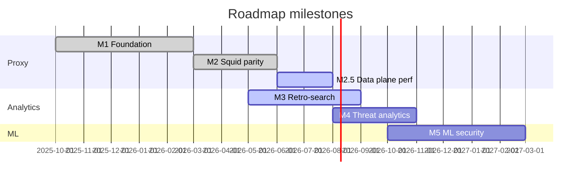

# Roadmap BSDM-Proxy

Целевое состояние проекта:

> **Альтернатива Squid с ретропоиском и ML для выявления отклонений, фишинга и C&C**

Три столпа развития:

| Столп | Описание |
|-------|----------|
| **Squid parity** | Forward proxy, кеш, ACL, auth, иерархия, rate limiting |
| **Ретропоиск** | Поиск и аналитика по историческому HTTP-трафику |
| **ML-безопасность** | Аномалии, фишинг и C&C поверх логов и поведенческих сигналов |

Текущая версия: **0.3.1** (post-release: tiered L1, M3 dashboards, CH/k8s docs) · [Releases](https://github.com/onixus/bsdm-proxy/releases) · [CHANGELOG](../CHANGELOG.md)

---

## Обзор milestones

| Milestone | Версия | Фокус | Готовность |
|-----------|--------|-------|------------|
| [M1 — Foundation](#m1--foundation-v02x) | v0.2.x | Ядро прокси, ACL, категоризация, observability | ✅ Done |
| [M2 — Squid parity](#m2--squid-parity-v03x) | v0.3.x | L2, ACL, hierarchy, auth, compression | ✅ Done |
| [M2.5 — Data plane](#m25--data-plane-throughput-v03x) | v0.3.x | Tiered L1, perf, streaming, policy cache | ~95% |
| [M3 — Retro-search](#m3--retro-search-v031) | v0.3.1+ | ClickHouse, Search API, Grafana | ~85% |
| [M4 — Threat analytics](#m4--threat-analytics-v05x) | v0.5.x | Rule-based угрозы, алерты, C&C heuristics | ~5% |
| [M5 — ML security](#m5--ml-security-v10x) | v1.0.x | ML anomaly, phishing ML, C&C detection | ~0% |



---

## M1 — Foundation (v0.2.x)

Базовый корпоративный HTTPS-прокси с политиками и наблюдаемостью. **✅ Завершён** (v0.2.3-test).

<details>
<summary>Выполнено (свернуть)</summary>

- [x] Hyper forward proxy + HTTP CONNECT, MITM TLS
- [x] L1 cache, Kafka → OpenSearch, Prometheus + Grafana
- [x] Auth Basic/LDAP, ACL, categorization, E2E harness
- [x] Hierarchy Phase 3, rate limit [#37](https://github.com/onixus/bsdm-proxy/issues/37), `ProxyService` refactor [#38](https://github.com/onixus/bsdm-proxy/issues/38)


</details>

---

## M2 — Squid parity (v0.3.x)

Полноценная замена Squid для корпоративного сценария. **✅ Завершён** (v0.3.0).

### Выполнено

- [x] Hierarchy Phase 4 — peer discovery, cache digest, HTCP ([#87](https://github.com/onixus/bsdm-proxy/pull/87) area)
- [x] Redis L2 — `docker-compose.redis-l2.yml`, `docker-compose.ha.yml`
- [x] HTTP/2 upstream — `UPSTREAM_HTTP2_ENABLED`
- [x] At-rest compression — Brotli/Zstd (`CACHE_COMPRESSION`)
- [x] ACL: TimeWindow, group Principal, REST API `/api/acl/*`
- [x] NTLM / Kerberos / LDAP group enrichment ([#44](https://github.com/onixus/bsdm-proxy/issues/44))
- [x] Negative cache, ETag revalidation (`REVALIDATED`)
- [x] Shared event schema — `bsdm-events` crate
- [x] HTTP Archive benchmarks — e2e + `scripts/compare-squid-bsdm-httparchive.sh` ([#90](https://github.com/onixus/bsdm-proxy/pull/90))

**Критерий завершения M2:** 3-tier cache, Redis L2, hierarchy metrics — **выполнен**.

---

## M2.5 — Data plane throughput (v0.3.x)

Закрытие gap к Squid на large-object workloads (HTTP Archive sites bench). См. [swg-backlog-mapping.md](swg-backlog-mapping.md), [ADR 0001](adr/0001-tiered-sharded-l1-cache.md).

### Выполнено

- [x] **Tiered L1** — mmap spill + `HttpL1Cache` shards ([#93](https://github.com/onixus/bsdm-proxy/pull/93))
- [x] **P0 perf** — `response_body()` Raw fast path, `TCP_SNDBUF_BYTES`, bench `WORKER_COUNT` ([#92](https://github.com/onixus/bsdm-proxy/pull/92))
- [x] **k8s / HA docs** — [k8s-architecture.md](k8s-architecture.md), Helm chart `charts/bsdm/` ([#113](https://github.com/onixus/bsdm-proxy/pull/113))
- [x] **Streaming MISS** — `TeeMissBody` tees upstream → client while buffering for L1; `STREAMING_MISS_ENABLED` (default `true`) ([#94](https://github.com/onixus/bsdm-proxy/issues/94))
- [x] **Connection auth cache** — per-TCP keep-alive `Proxy-Authorization` reuse; `AUTH_CONN_CACHE_TTL_SECONDS` ([#95](https://github.com/onixus/bsdm-proxy/issues/95))
- [x] **Policy decision cache** — `(principal, domain)` ACL+cat; `POLICY_DECISION_CACHE_TTL_SECONDS`; flush on ACL reload ([#96](https://github.com/onixus/bsdm-proxy/issues/96))
- [x] **HTTP Archive bench profiles** — `BENCH_PROFILE=warm|cold` → `WORKER_COUNT` 1/4; `bench-profile.sh` ([#97](https://github.com/onixus/bsdm-proxy/issues/97))
- [x] **Spill file permissions** — `CACHE_SPILL_DIR` `0o700`, spill files `0o600` on Unix ([#98](https://github.com/onixus/bsdm-proxy/issues/98))

### В работе (P0)

_Нет открытых P0 — gate M2.5: warm goodput HTTP Archive ≥ Squid −5%._

### P1 (single-pass hot path)

[#100](https://github.com/onixus/bsdm-proxy/issues/100) fast path matrix · [#104](https://github.com/onixus/bsdm-proxy/issues/104) offline categorization · [#106](https://github.com/onixus/bsdm-proxy/issues/106) Kafka bounded queue · [#109](https://github.com/onixus/bsdm-proxy/issues/109) ACL read-mostly

**Критерий завершения M2.5:** warm goodput на HTTP Archive sites bench ≥ Squid −5%; P0 issues закрыты.

---

## M3 — Retro-search (v0.4.x)

Ретроспективный поиск и аналитика по HTTP-трафику.

### Архитектура

```
proxy → Kafka → cache-indexer → ClickHouse
```

**Default compose:** ClickHouse + Grafana SQL dashboards + Search API ([#125](https://github.com/onixus/bsdm-proxy/issues/125)).

### Текущий gap

- CSV/JSON export polish for SOC playbooks (Search API already supports `format=csv`)
- Session correlation across multi-node proxies (today: per-node soft sessions)

### Задачи

- [x] **Схема событий** — `bsdm-events`: `categories`, `acl_action`, `threat_sources`, ACL deny events
- [x] **OpenSearch retention** — ISM 14d hot → delete 42d ([#91](https://github.com/onixus/bsdm-proxy/pull/91))
- [x] **OpenSearch Dashboards** — saved searches, playbook «traffic to domain», **BSDM HTTP Traffic** dashboard
- [x] **ClickHouse foundation** — schema + slim compose (merged into main `docker-compose.yml`) ([#115](https://github.com/onixus/bsdm-proxy/pull/115))
- [x] **ClickHouse indexer** — `INDEXER_BACKEND=clickhouse`, JSONEachRow INSERT ([#114](https://github.com/onixus/bsdm-proxy/issues/114))
- [x] **Grafana + Search API** — CH dashboards, `/api/search` ([#129](https://github.com/onixus/bsdm-proxy/issues/129), [#130](https://github.com/onixus/bsdm-proxy/issues/130))
- [x] **Default compose on ClickHouse** — `docker compose up` ([#132](https://github.com/onixus/bsdm-proxy/issues/132))
- [x] **Remove OpenSearch backend** — ClickHouse-only cache-indexer ([#134](https://github.com/onixus/bsdm-proxy/issues/134))
- [x] **Session correlation** — `session_id`, redirect chains (`parent_event_id` / `redirect_url`)
- [ ] **Экспорт** — CSV/JSON для SOC

**Критерий завершения M3:** аналитик находит «кто ходил на domain X за 30 дней» через Dashboards **или** Grafana/CH SQL; CH indexer в production path.

---

## M4 — Threat analytics (v0.5.x)

Rule-based обнаружение угроз (без ML). Запросы и алерты — преимущественно **ClickHouse SQL / materialized views**.

### Задачи

- [ ] **Обогащение событий** — reputation, URLhaus/PhishTank metadata ([#102](https://github.com/onixus/bsdm-proxy/issues/102))
- [ ] **Rule-based alerts** — burst domain, off-hours, blocked burst
- [ ] **C&C heuristics** — beacon pattern, high-entropy domains
- [ ] **Alerting** — CH/Grafana alerting или webhook worker
- [ ] **Threat dashboard** — Grafana + CH
- [ ] **Categorization metrics** ([#105](https://github.com/onixus/bsdm-proxy/issues/105))
- [ ] **PhishTank API key** (`PHISHTANK_API_KEY`)

**Критерий завершения M4:** автоматический алерт на beacon-паттерн; threat dashboard с top blocked categories.

**Зависимости:** M3 (данные в CH).

---

## M5 — ML security (v1.0.x)

ML-слой поверх ClickHouse (batch) + опциональный inline score.

### Задачи

- [ ] **Feature store** — CH SQL / batch export (frequency, entropy, timing, UA)
- [ ] **Anomaly detection** — baseline per user/IP, Isolation Forest
- [ ] **Phishing ML** — URL features + optional MITM body
- [ ] **C&C ML** — FFT beacon, DGA classifier
- [ ] **Real-time scoring** (optional) — inline risk в proxy
- [ ] **ML pipeline** — training worker + model registry

**Критерий завершения M5:** ML anomaly score в store; алерт на C&C без blocklist hit.

---

## Матрица зрелости

| Столп | Сейчас | После M2.5 | После M3 | После M5 |
|-------|--------|------------|----------|----------|
| Squid parity | **~90%** | ~92% | ~92% | ~93% |
| Ретропоиск | **~60%** | ~60% | ~80% | ~90% |
| ML / C&C / phishing | ~5% | ~5% | ~10% | ~75% |
| **Итого** | **~52%** | ~55% | ~65% | ~85% |

---

## GitHub milestones

| GitHub Milestone | Версия | Ключевые issues |
|------------------|--------|-----------------|
| M1 Foundation | 0.2.x | #37, #38, #44 |
| M2 Squid parity | 0.3.x | hierarchy, L2, ACL API |
| M2.5 Data plane | 0.3.1 | [#94](https://github.com/onixus/bsdm-proxy/issues/94)–[#98](https://github.com/onixus/bsdm-proxy/issues/98) |
| M3 Retro-search | 0.4.x | [#114](https://github.com/onixus/bsdm-proxy/issues/114), [#110](https://github.com/onixus/bsdm-proxy/issues/110) |
| M4 Threat analytics | 0.5.x | [#102](https://github.com/onixus/bsdm-proxy/issues/102), [#105](https://github.com/onixus/bsdm-proxy/issues/105) |
| M5 ML security | 1.0.x | — |

Полный backlog P0–P3: [swg-backlog-mapping.md](swg-backlog-mapping.md) (issues [#94](https://github.com/onixus/bsdm-proxy/issues/94)–[#112](https://github.com/onixus/bsdm-proxy/issues/112)).

---

## Связанные документы

| Документ | Тема |
|----------|------|
| [architecture.md](architecture.md) | Компоненты, блокеры B1–B25 |
| [adr/0001-tiered-sharded-l1-cache.md](adr/0001-tiered-sharded-l1-cache.md) | Tiered L1 + shards |
| [adr/0002-clickhouse-analytics.md](adr/0002-clickhouse-analytics.md) | ClickHouse analytics |
| [swg-backlog-mapping.md](swg-backlog-mapping.md) | SWG leaders → backlog |
| [k8s-architecture.md](k8s-architecture.md) | Kubernetes |
| [clickhouse-analytics.md](clickhouse-analytics.md) | CH compose + SQL |
| [benchmarks-httparchive.md](benchmarks-httparchive.md) | HTTP Archive bench |
| [performance.md](performance.md) | Perf tuning |
| [hierarchical-caching.md](hierarchical-caching.md) | ICP/HTCP |
| [capacity-planning.md](capacity-planning.md) | Sizing |

---

*Последнее обновление: 2026-06 — M2.5 data plane, M3 ~85%, ClickHouse, wiki deployment/docker/k8s*
