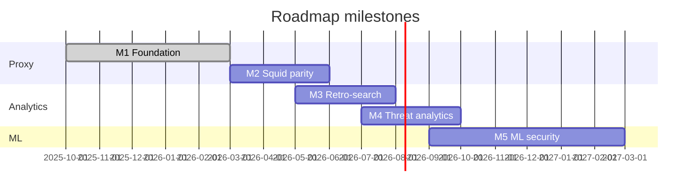

# Roadmap BSDM-Proxy

Целевое состояние проекта:

> **Альтернатива Squid с ретропоиском и ML для выявления отклонений, фишинга и C&C**

Три столпа развития:

| Столп | Описание |
|-------|----------|
| **Squid parity** | Forward proxy, кеш, ACL, auth, иерархия, rate limiting |
| **Ретропоиск** | Поиск и аналитика по историческому HTTP-трафику |
| **ML-безопасность** | Аномалии, фишинг и C&C поверх логов и поведенческих сигналов |

Текущая версия: **0.2.3-test** · [Releases](https://github.com/onixus/bsdm-proxy/releases) · [release notes](releases/v0.2.3-test.md)

---

## Обзор milestones

| Milestone | Версия | Фокус | Готовность |
|-----------|--------|-------|------------|
| [M1 — Foundation](#m1--foundation-v02x) | v0.2.x | Ядро прокси, ACL, категоризация, observability, иерархия | ✅ Done |
| [M2 — Squid parity](#m2--squid-parity-v03x) | v0.3.x | L2, rate limit, полный ACL, hierarchy Phase 4 | ~45% |
| [M3 — Retro-search](#m3--retro-search-v04x) | v0.4.x | Индексация, дашборды, поиск по истории | ~15% |
| [M4 — Threat analytics](#m4--threat-analytics-v05x) | v0.5.x | Rule-based угрозы, алерты, C&C heuristics | ~5% |
| [M5 — ML security](#m5--ml-security-v10x) | v1.0.x | ML anomaly, phishing ML, C&C beacon detection | ~0% |

---

## M1 — Foundation (v0.2.x)

Базовый корпоративный HTTPS-прокси с политиками и наблюдаемостью.

### Выполнено

- [x] Hyper forward proxy + HTTP CONNECT
- [x] MITM TLS (порты 443/8443), динамические сертификаты
- [x] L1 in-memory cache (`quick_cache`)
- [x] Kafka producer (async cache events)
- [x] cache-indexer → OpenSearch
- [x] Prometheus metrics (20+) + Grafana dashboard
- [x] Health endpoints (`/health`, `/ready`, `/metrics`)
- [x] Graceful shutdown
- [x] Proxy auth: Basic + LDAP (feature `auth-ldap`)
- [x] ACL: domain, URL prefix, regex, category, IP, user
- [x] URL categorization: Shallalist, URLhaus, PhishTank, custom DB
- [x] E2E / smoke test harness
- [x] Release packaging (`0.2.2b`) + systemd
- [x] Hierarchical caching Phase 3 — modules in lib, ICP server, peer HTTP fetch, env config
- [x] Optional MITM CA (`MITM_ENABLED=false` без `ca.key`)
- [x] Pre-push hook (`fmt` + `clippy`)

### В работе / осталось в M1

- [x] Rate limiting per user/IP — [#37](https://github.com/onixus/bsdm-proxy/issues/37)
- [x] Рефакторинг `main.rs` — вынос `ProxyService` в lib — [#38](https://github.com/onixus/bsdm-proxy/issues/38)
- [x] Hierarchy E2E / `docker-compose.hierarchy.yml`
- [x] Документация NTLM: помечен как M2 / не реализован — [#44](https://github.com/onixus/bsdm-proxy/issues/44)
- [x] Документация логирования (`RUST_LOG`, профили production/dev)

**Критерий завершения M1:** все CI зелёные — **выполнен** (v0.2.3-test).

---

## M2 — Squid parity (v0.3.x)

Полноценная замена Squid для корпоративного сценария (без ML).

### Задачи

- [x] **Hierarchy Phase 4** — peer discovery, cache digest, HTCP (опционально mTLS — отложено)
- [x] **Redis L2 cache** — распределённый кеш между инстансами (`docker-compose.redis-l2.yml`)
- [x] **HTTP/2 upstream client** — `UPSTREAM_HTTP2_ENABLED` + ALPN h2
- [x] **Compression** — Brotli/Zstd at-rest for cacheable responses (`CACHE_COMPRESSION`)
- [ ] **ACL completeness**
  - [x] TimeWindow rules (`HH:MM`, local time, overnight windows)
  - [x] Group-based Principal rules (LDAP `memberOf` cn matching)
  - [x] REST API управления ACL (`/api/acl/*` на `METRICS_PORT`)
- [ ] **NTLM auth** — реализация или снятие с roadmap
- [x] **Negative caching** — upstream 403/404 с коротким TTL (`NEGATIVE_CACHE_*`)
- [x] **Cache refresh / revalidate** — `Cache-Control`, ETag / `If-Modified-Since`, `304` → `REVALIDATED`
- [x] Hierarchy Prometheus metrics (`bsdm_proxy_hierarchy_*`)

**Критерий завершения M2:** 3-tier cache hierarchy в docker-compose, hit rate sibling/parent измеряется, Redis L2 работает.

**Зависимости:** M1 (B6 rate limit, B7 refactor).

---

## M3 — Retro-search (v0.4.x)

Ретроспективный поиск и аналитика по HTTP-трафику.

### Текущий gap

Pipeline Kafka → OpenSearch есть, но:
- поле `categories` теряется в `cache-indexer`
- нет OpenSearch Dashboards в стеке
- нет saved searches и search API

### Задачи

- [ ] **Расширить схему событий**
  - [ ] `categories`, `acl_action`, `threat_sources` в indexer
  - [ ] OpenSearch index template + mapping
  - [ ] ILM / retention policy
- [ ] **OpenSearch Dashboards** в `docker-compose.yml`
- [ ] **Saved searches / playbooks**
  - [ ] Все запросы пользователя X за период
  - [ ] Доступ к домену Y
  - [ ] Blocked + phishing/malware events
  - [ ] Top domains per user / per IP
- [ ] **Search API** (опционально) — thin REST поверх OpenSearch
- [ ] **Session correlation** — `session_id`, redirect chains
- [ ] **Экспорт** — CSV/JSON для SOC

**Критерий завершения M3:** аналитик находит «кто ходил на домен X за 30 дней» через Dashboards без ручного curl; categories индексируются.

**Зависимости:** M1 (стабильный event pipeline).

---

## M4 — Threat analytics (v0.5.x)

Rule-based обнаружение угроз и алертинг (без ML, быстрый win).

### Задачи

- [ ] **Обогащение событий** — reputation score, URLhaus/PhishTank metadata в индексе
- [ ] **Rule-based anomaly alerts**
  - [ ] Burst к новому/редкому домену
  - [ ] Off-hours activity spike
  - [ ] Множество blocked requests от одного user/IP
- [ ] **C&C heuristics (rules)**
  - [ ] Периодические короткие запросы к одному host:port (beacon pattern)
  - [ ] Long-tail / high-entropy domain scoring
  - [ ] Корреляция: user → множество POST к редким хостам
- [ ] **Alerting pipeline** — OpenSearch Alerting → webhook / email / SIEM
- [ ] **Threat dashboard** — Grafana или OpenSearch Dashboards
- [ ] **Categorization metrics** в Prometheus (документированы, не реализованы)
- [ ] **PhishTank API key** support (`PHISHTANK_API_KEY`)

**Критерий завершения M4:** автоматический алерт при beacon-подобном паттерне; threat dashboard показывает top blocked categories.

**Зависимости:** M3 (полная схема данных в OpenSearch).

---

## M5 — ML security (v1.0.x)

ML-слой для аномалий, фишинга и C&C.

### Задачи

- [ ] **Feature store** — извлечение признаков из OpenSearch (frequency, entropy, timing, UA, geo)
- [ ] **Anomaly detection**
  - [ ] Baseline per user/IP (volume, unique domains, time distribution)
  - [ ] Isolation Forest / statistical models (batch)
  - [ ] OpenSearch Anomaly Detection integration
- [ ] **Phishing ML**
  - [ ] URL feature model (дополнение PhishTank blocklist)
  - [ ] HTML/content features через MITM body (опционально)
- [ ] **C&C ML**
  - [ ] Beacon detection (FFT / autocorrelation интервалов)
  - [ ] DGA domain classifier
- [ ] **Real-time scoring** (optional) — inline risk score в proxy path
- [ ] **Feedback loop** — FP/FN разметка → переобучение
- [ ] **ML pipeline** — training worker (Python/Rust) + model registry

**Критерий завершения M5:** ML anomaly score в индексе; алерт на C&C beacon без URL в blocklist; документированный pipeline обучения.

**Зависимости:** M3 (данные), M4 (heuristics как baseline).

---

## Матрица зрелости

| Столп | Сейчас (0.2.3-test) | После M2 | После M3 | После M5 |
|-------|-----------------|----------|----------|----------|
| Squid parity | ~55% | ~85% | ~85% | ~90% |
| Ретропоиск | ~15% | ~15% | ~80% | ~90% |
| ML / C&C / phishing | ~5% | ~5% | ~10% | ~75% |
| **Целевое состояние** | **~25%** | **~35%** | **~60%** | **~85%** |

---

## GitHub milestones

Issues привязывайте к milestones:

| GitHub Milestone | Версия | Label suggestion |
|------------------|--------|------------------|
| `M1: Foundation (v0.2.x)` | 0.2.x | `milestone:m1` |
| `M2: Squid parity (v0.3.x)` | 0.3.x | `milestone:m2` |
| `M3: Retro-search (v0.4.x)` | 0.4.x | `milestone:m3` |
| `M4: Threat analytics (v0.5.x)` | 0.5.x | `milestone:m4` |
| `M5: ML security (v1.0.x)` | 1.0.x | `milestone:m5` |

---

## Связанные документы

- [architecture.md](architecture.md) — архитектура и блокеры B1–B25
- [hierarchical-caching.md](hierarchical-caching.md) — дизайн ICP/HTCP (M2)
- [logging.md](logging.md) — `RUST_LOG` и профили логирования
- [categorization.md](categorization.md) — threat intel feeds (M1/M4)
- [acl.md](acl.md) — политики доступа (M1/M2)
- [development.md](development.md) — сборка и тесты

---

*Последнее обновление: v0.2.3-test (M2 in progress — L2, HTTP/2, compression)*
