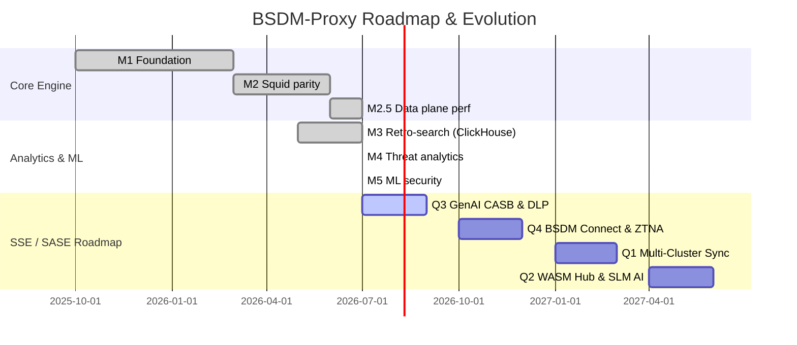

# Roadmap & План работ BSDM-Proxy (v0.6+)

> **Целевое состояние проекта:** Высокопроизводительный корпоративный SWG нового поколения на базе Rust с ретропоиском в ClickHouse, ML-аналитикой угроз и трансформацией в платформу **Gartner SSE / SASE** (Security Service Edge).

Текущая версия: **0.6.0** (`v0.6`) · [Releases](https://github.com/onixus/bsdm-proxy/releases) · [CHANGELOG](../CHANGELOG.md)

---

## 1. Матрица зрелости и Столпы платформы

| Столп | Описание | Зрелость (v0.6) | Целевое (2027) |
|-------|----------|-----------------|----------------|
| **Squid Parity** | Forward proxy, TLS MITM, кэширование L1/L2, ACL, Auth, HTCP иерархия | **~93%** ✅ | ~95% |
| **Ретропоиск** | Поиск и SOC-аналитика по историческому HTTP-трафику в ClickHouse | **~95%** ✅ | ~98% |
| **ML-безопасность** | Feature Store, UEBA z-score, лексический фишинг, C&C беконы, Flight Risk | **~90%** ✅ | ~95% |
| **SSE / SASE Evolution** | eBPF XDP, DoH/DoT, WASM плагины, AI Cache, GenAI CASB, Inline DLP | **~75%** 🚀 | ~95% |
| **Итоговый уровень** | **Комплексный статус решения** | **~88%** | **~96%** |

---

## 2. Реализованные вехи разработки (Completed Milestones)

### M1 — Foundation (v0.2.x) ✅
- [x] Hyper forward proxy + HTTP CONNECT, MITM TLS.
- [x] L1 cache, Kafka event pipeline, Prometheus метрики + Grafana дашборды.
- [x] Auth (Basic / LDAP), ACL, категориальная фильтрация, E2E тестовый каркас.
- [x] Иерархия Phase 3, rate limiting, рефакторинг `ProxyService`.

### M2 — Squid Parity (v0.3.x) ✅
- [x] Иерархия Phase 4 — peer discovery, cache digest, HTCP.
- [x] Redis L2 кэш, HTTP/2 upstream, at-rest сжатие.
- [x] ACL TimeWindow, REST Control API, группы NTLM / Kerberos / LDAP.
- [x] Negative cache, ETag revalidation, библиотека `bsdm-events`.

### M2.5 — Data Plane Throughput (v0.3.1–0.3.2) ✅
- [x] Tiered L1, streaming MISS, кэширование полисов и авторизации.
- [x] Fast cache path, bounded Kafka queue, оффлайн категоризация, прекомпиляция ACL.
- [x] Профили бенчмарков HTTP Archive.

### M3 — Retro-Search (v0.3.1+) ✅
- [x] Схема ClickHouse (`bsdm.http_cache`) + индексатор `cache-indexer` (JSONEachRow).
- [x] `/api/search` (JSON/CSV export) + Grafana дашборды для SOC.
- [x] Session correlation, поддержка ClickHouse Operator (CHI) в Kubernetes.

### M4 — Threat Analytics (v0.5.x) ✅
- [x] Обогащение схемы блокировками угроз в ClickHouse.
- [x] Движок уведомлений `alert-worker` (webhooks, SIEM integration).
- [x] Эвристика C&C беконов (`beacon_periodic`) + энтропия Шеннона (`ALERT_SHANNON_*`).
- [x] Интеграция PhishTank API key, правила Grafana Unified Alerting и Prometheus Alertmanager.

### M5 — ML Security (v1.0.x / v0.5.x+) ✅
- [x] **M5.1 Scaffolding:** ADR 0003, Feature Store на ClickHouse, бинарник `ml-worker`.
- [x] **M5.2 UEBA:** Модель `ueba_zscore_v0` (базовые профили пользователей/IP).
- [x] **M5.3 Phishing:** Модель `phishing_lexical_v0` (энтропия доменов, ключевые слова).
- [x] **M5.4 C&C Beacon ML:** Модель `cc_beacon_v0` на парах `(client_ip, domain)`.
- [x] **M5.5 Flight Risk ML:** Модель `flight_risk_v0` для выявления рисков увольнения/выгрузки данных.
- [x] **M5.6 Threat Score Write-Back:** Кэш `threat_score_cache` + `GET /api/threat-scores` для O(1) блокировок в прокси.

---

## 3. Выполненные стратегические векторы v0.6

- **Lite Mode:** Запуск прокси с локальным SQLite индексатором (`docker-compose.lite.yml`) без зависимостей от Kafka и ClickHouse.
- **Control Plane:** REST и gRPC API (`--features grpc`) для динамической перезагрузки ACL, иерархии и TLS-сертификатов без простоя.
- **WASM Plugins & SDK:** Рантайм Wasmtime (`--features wasm`), библиотека [`bsdm-wasm-sdk`](../bsdm-wasm-sdk/), горячая перезагрузка модулей через Control API.
- **AI Traffic Optimization:** Singleflight request coalescing (`MISS_COALESCE_ENABLED`), API Key Rate Limiting, семантическое кэширование с вектором Qdrant Vector DB.
- **Encrypted DNS & Kernel Drops:** eBPF XDP аппаратный сброс пакетов, DoH (RFC 8484) и DoT (RFC 7858) шифрованные DNS-шлюзы в `dns-sinkhole`.
- **Admin Console & Automation:** Однострочные инсталлеры (`Makefile`, `setup.ps1`, `install.sh`), обновленный Web UI с интерактивными графиками и расследованиями.

---

## 4. Конкурентный анализ Gartner SSE/SASE & USPs

**Лидеры рынка по Gartner:** Zscaler (ZIA), Palo Alto Networks (Prisma Access), Netskope, Cloudflare WARP.

| Возможность (Gartner Core SSE) | Лидеры рынка | BSDM-Proxy (Текущее состояние v0.6) | Оценка |
|--------------------------------|--------------|--------------------------------|--------|
| **Secure Web Gateway (SWG)** | Облачный масштаб, категоризация, SSL-инспекция | Нативный Rust, MITM, L1/L2 кэш, ACL, eBPF XDP, DoH/DoT | 🟩 **Превосходит (по скорости)** |
| **Advanced Threat Protection** | Sandbox, AI-based эвристика | ML-пайплайн в ClickHouse (UEBA, C&C, Phishing, Flight Risk) | 🟩 **Сильно** (асинхронный ML write-back) |
| **Cloud Access Security Broker (CASB)**| Контроль SaaS-приложений | Категоризация доменов | 🟨 **В плане (Q3 2026: GenAI CASB)** |
| **Data Loss Prevention (DLP)** | OCR, Regex в реальном времени | Инспекция через Wasm/ICAP | 🟨 **В плане (Q3 2026: Inline DLP)** |
| **Zero Trust Network Access (ZTNA)**| Доступ к приватным сервисам | Forward Proxy | 🟨 **В плане (Q4 2026: Reverse IAP)** |
| **Endpoint Agent** | Zscaler Connector, WARP | PAC-файлы, GPO, eBPF | 🟨 **В плане (Q4 2026: BSDM Connect)** |

### Уникальные маркетинговые преимущества (USPs):
1. **Data Sovereignty (100% Суверенитет данных):** 100% On-Premise или Private Cloud. Ключи SSL, телеметрия и логи не уходят во внешнее облако вендора.
2. **"Стеклянная коробка" ML-аналитики (White-Box AI):** Полный доступ к SQL-фичам в ClickHouse, возможность кастомизации ML-моделей под корпоративные требования.
3. **Rust-Native Speed & Memory Safety:** Минимальные задержки, эффективное использование CPU/RAM при многопоточной SSL-дешифровке.
4. **WASM-Расширяемость:** Кастомная бизнес-логика и парсинг протоколов через скомпилированные Wasm-модули без модификации ядра прокси.

---

## 5. План работ (Actionable Work Plan: Q3 2026 – Q2 2027)

### 🗓️ Q3 2026: Защита ИИ и Встроенный DLP (GenAI CASB & Inline DLP)
- [ ] **LLM Data Guard (GenAI CASB):** 
  * Wasm-модуль для инспекции и фильтрации API-запросов к OpenAI (ChatGPT), Anthropic (Claude) и Microsoft Copilot.
  * Автоматическая блокировка передачи исходного кода, API-ключей и персональных данных (PII) в LLM.
- [ ] **Inline DLP Engine (v1):**
  * Встроенный сканер регулярных выражений (DLP) для исходящих HTTP POST/PUT запросов.
  * Маскирование и блокировка PII, номеров кредитных карт и коммерческой тайны в режиме потока (без буферизации больших файлов в память).

### 🗓️ Q4 2026: Гибридный доступ и ZTNA Foundation
- [ ] **BSDM Connect (Легкий Endpoint-агент):**
  * Компактный клиент под Windows, macOS и Linux на базе WireGuard для завертывания веб-трафика удаленных сотрудников в корпоративный BSDM-Proxy.
- [ ] **Identity-Aware Reverse Proxy (IAP / ZTNA):**
  * Поддержка режима обратного прокси (Reverse Proxy) для защиты доступа к внутренним веб-ресурсам компании.
  * Интеграция с OIDC / OAuth2 провайдерами (Okta, Keycloak, Microsoft Entra ID).

### 🗓️ Q1 2027: Распределенная Enterprise-Экосистема
- [ ] **Global Session State:**
  * Синхронизация `session_id` и лимитов Rate Limiting между репликами в мульти-кластерной Kubernetes-среде через Redis / KeyDB.
- [ ] **Real-Time Threat Sync:**
  * P2P-обмен индикаторами компрометации (IoC) и ML-скорами угроз между независимыми инстансами прокси (по протоколу Gossip).

### 🗓️ Q2 2027: WASM Marketplace и Local AI
- [ ] **BSDM Plugin Hub (Маркетплейс Wasm):**
  * Открытый портал для публикации и удобной установки сторонних Wasm-плагинов сообщества.
- [ ] **Zero-Day AI Categorization:**
  * Интеграция локальных компактных языковых моделей (SLM) для классификации не размеченных доменов на лету.

---

## 6. Связанная документация

| Документ | Тема |
|----------|------|
| [README.md](README.md) | Главный навигационный портал и карта Wiki |
| [architecture/overview.md](architecture/overview.md) | Компоненты ядра и поток данных |
| [features/control-plane.md](features/control-plane.md) | REST и gRPC Control Plane API |
| [features/wasm-plugins.md](features/wasm-plugins.md) | Инструкция по созданию Wasm-плагинов |
| [analytics/ml-security.md](analytics/ml-security.md) | Feature Store, ML models и скоринг |
| [analytics/clickhouse-retrosearch.md](analytics/clickhouse-retrosearch.md) | ClickHouse DDL, ретропоиск и Search API |
| [features/dns-sinkhole.md](features/dns-sinkhole.md) | UDP / DoH / DoT DNS Sinkhole |
| [features/icap-inspection.md](features/icap-inspection.md) | Взаимодействие с внешними ICAP/AV сканерами |
| [getting-started/lite-mode.md](getting-started/lite-mode.md) | Автономный запуск в режиме Lite |
| [architecture/capacity-planning.md](architecture/capacity-planning.md) | Расчет аппаратных ресурсов |

---

*Обновлено: Июль 2026 · Релиз v0.6.0 · Все roadmap и backlog данные консолидированы.*
