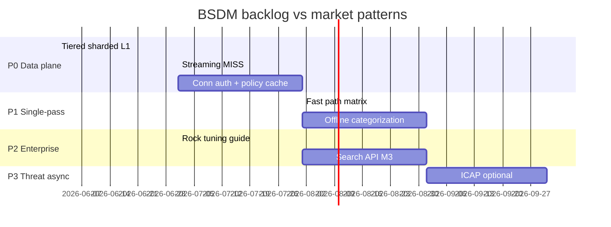

# BSDM ↔ Market Leaders: backlog mapping

Сопоставление возможностей **BSDM-Proxy** с архитектурой лидеров **SSE/SWG** (Zscaler, Netskope, Palo Alto Prisma Access) и с **Squid rock** как референсом on-prem data plane.

См. также: [roadmap.md](roadmap.md) · [adr/0001-tiered-sharded-l1-cache.md](adr/0001-tiered-sharded-l1-cache.md) · [performance.md](performance.md)

---

## Позиционирование

| Ось | BSDM сейчас | Zscaler / Netskope / Palo Alto |
|-----|-------------|--------------------------------|
| Deployment | self-hosted forward proxy | cloud PoP / multitenant SaaS |
| Сильная сторона | Squid-parity cache + hierarchy + retro-search pipeline | single-pass inline security at scale |
| Слабая сторона | data plane throughput, policy on hot path | не ваш on-prem control plane |
| Уникальность | Kafka → OpenSearch ретропоиск + ML roadmap | commodity cloud SWG |

**Цель mapping:** не копировать cloud SWG целиком, а взять **data-plane и policy patterns**, которые закрывают измеримые gaps (HTTP Archive bench, enterprise proxy shops).

---

## Матрица: лидеры vs BSDM (v0.3.0 + PR #93)

Легенда: ✅ есть · ⚠️ частично · ❌ нет · 🎯 backlog

### Data plane (hot path)

| Паттерн лидеров | Zscaler | Netskope | Palo Alto | BSDM | Backlog |
|-----------------|---------|----------|-----------|------|---------|
| Cloud-native proxy (не FW-in-cloud) | ZIA Service Edge | NewEdge POP | Prisma explicit proxy | ✅ forward HTTP proxy | — |
| Single-pass inspection | Single Scan Multi-Action | single-pass microservices | unified threat stack | ⚠️ цепочка auth→ACL→cat→cache | **P0** unified fast path |
| Sharded L1 / reduced lock contention | multitenant internal | per-POP shards | cloud scale-out | ✅ `HttpL1Cache` (PR #93) | merge #93 |
| Tiered body storage (inline + spill) | cloud object store | bare-metal optimized | cloud store | ✅ mmap spill (PR #93) | merge #93 |
| Zero-copy large HIT serve | yes | yes | yes | ✅ `Bytes::from_owner` | — |
| Streaming MISS (tee upstream→client) | yes | yes | yes | ❌ buffer-then-serve | **P0** `streaming_miss` |
| Connection-level auth cache | session at edge | identity on tunnel | GP session | ❌ auth per request | **P0** `conn_auth_cache` |
| Policy decision cache | context cached at edge | unified policy engine | forwarding profiles | ❌ ACL+cat every request | **P0** `policy_decision_cache` |
| PERF_FAST_CACHE_HIT (skip policy on HIT) | implicit | implicit | implicit | ✅ env flag | default on bench |
| Multi-worker accept (SO_REUSEPORT) | internal | internal | internal | ✅ `WORKER_COUNT` | tune 1 vs 4 profiles |
| TCP send buffer tuning | internal | internal | internal | ✅ `TCP_SNDBUF_BYTES` | merge PR #92 |
| Full TLS MITM at scale | 100% cloud | 100% cloud | 100% cloud | ⚠️ MITM 443/8443 | cert lifecycle, exceptions |
| HTTP/2 upstream | yes | yes | yes | ✅ `UPSTREAM_HTTP2_ENABLED` | — |
| HTTP/2 to client | yes | yes | limited | ❌ HTTP/1.1 only | **P2** h2 server |

### Cache & hierarchy

| Паттерн | Zscaler | Netskope | Palo Alto | BSDM | Backlog |
|---------|---------|----------|-----------|------|---------|
| L1 RAM cache | minimal | minimal | minimal | ✅ sharded quick_cache | — |
| Disk / mmap spill (rock-like) | internal | internal | internal | ✅ `CACHE_SPILL_*` | chmod 0600 spill |
| L2 shared cache (Redis) | cloud internal | cloud internal | cloud internal | ✅ Redis L2 | — |
| Parent/sibling hierarchy | limited | limited | limited | ✅ ICP/HTCP/digest | mTLS peers **P2** |
| Negative cache | yes | yes | yes | ✅ `NEGATIVE_CACHE_*` | — |
| Revalidation (304) | yes | yes | yes | ✅ ETag/IMS | — |
| At-rest compression | internal | internal | internal | ✅ zstd/brotli | — |
| Aggressive object cache (Squid-style) | no | no | no | ⚠️ tuning gap vs Squid | see § Squid rock |

### Security services (cold path / async)

| Сервис | Zscaler | Netskope | Palo Alto | BSDM | Backlog |
|--------|---------|----------|-----------|------|---------|
| URL filtering / categories | cloud intel | SkopeIT | PAN-DB | ⚠️ Shallalist+URLhaus+PhishTank | offline cat DB **P1** |
| AV / sandbox | cloud | cloud | WildFire | ❌ | ICAP or async scan **P3** |
| DLP (body) | inline | inline | Enterprise DLP | ❌ | M5 / optional ICAP **P4** |
| RBI (remote browser) | yes | yes | yes | ❌ | out of scope v1 |
| CASB / SaaS control | yes | yes | NG-CASB | ❌ | out of scope v1 |
| ZTNA | ZPA | NPA | Prisma Access | ❌ | out of scope v1 |
| DNS security layer | limited | limited | limited | ❌ | optional **P3** |
| Threat intel inline score | yes | yes | yes | ❌ | M4 rules → M5 ML |
| Rate limiting | yes | yes | yes | ✅ token bucket | — |

### Control plane & observability

| Возможность | Лидеры | BSDM | Backlog |
|-------------|--------|------|---------|
| Central admin console | SaaS UI | JSON ACL + REST API | web-config UI **P2** |
| Identity-aware policy | user/device/location | user/group/IP/time | device posture **P4** |
| Global PoP / anycast | 120–150+ DC | single node / K8s | HA guide **P2** |
| Async telemetry (не на hot path) | yes | ⚠️ Kafka inline (sampled) | **P1** async-only events |
| Retro-search / SOC | cloud logs | Kafka→OpenSearch | M3 Search API |
| SIEM export | native | OpenSearch/Kafka | ILM + schema **M3** |

---

## Приоритизированный backlog (по паттернам лидеров)

### P0 — Data plane throughput (закрывает HTTP Archive gap)

Измеримая цель: warm goodput **538 → 600+ Mbit/s** на sites bench (70×2.6MB, 12 conn).

| ID | Задача | Паттерн у лидеров | Файлы / заметки |
|----|--------|-------------------|-----------------|
| P0-1 | Merge tiered + sharded L1 | NewEdge bare-metal tiering | PR #93 |
| P0-2 | Merge TCP sndbuf + bench defaults | edge socket tuning | PR #92 |
| P0-3 | **Streaming MISS** — tee upstream→client while caching | все лидеры: no buffer-full-object | `proxy_service.rs`, `upstream.rs` |
| P0-4 | **Connection-level auth** — cache `Proxy-Authorization` outcome per TCP conn | identity on tunnel (ZCC/GP) | `server.rs`, `auth.rs` |
| P0-5 | **Policy decision cache** — `(user, domain, url_hash) → Allow/Deny` TTL 60–300s | unified policy engine cache | `proxy_service.rs`, `acl.rs` |
| P0-6 | Bench profiles: `WORKER_COUNT=1` warm / `4` cold | internal tuning | `compare-squid-bsdm-httparchive.sh` |
| P0-7 | Spill file `mode(0o600)` + private `CACHE_SPILL_DIR` | security hygiene | `cache_body.rs` |

### P1 — Single-pass policy path (как Single Scan / single-pass)

| ID | Задача | Паттерн | Заметки |
|----|--------|---------|---------|
| P1-1 | **Fast path matrix** — явная таблица: HIT / REVALIDATED / negative HIT skip cat+ACL | Zscaler fast path implicit | extend `PERF_FAST_CACHE_HIT` |
| P1-2 | **Offline categorization** — Shallalist-only on hot path; URLhaus async enrich | cloud intel async | `categorization.rs` |
| P1-3 | **Kafka fully async** — never block response on producer; drop+metric on full queue | telemetry off hot path | `pipeline.rs` |
| P1-4 | **ACL read lock** — remove inner Mutex on regex compile cache | read-mostly policy | `acl.rs` (B9) |
| P1-5 | `x-cache-status: MISS` on first upstream byte | observability | `proxy_service.rs` |

### P2 — Squid parity + enterprise deploy

| ID | Задача | Squid / enterprise | Заметки |
|----|--------|-------------------|---------|
| P2-1 | **Rock-equivalent tuning guide** — spill threshold vs object size distribution | Squid `cache_dir rock` | `capacity-planning.md` |
| P2-2 | **Peer mTLS** | hierarchy security | `peer_fetch.rs` |
| P2-3 | **HA deployment** — Redis L2 + sticky-less LB + shared spill dir or no-spill | cloud PoP equivalent | docs + compose |
| P2-4 | OpenSearch Search API (M3) | retro-search differentiator | `cache-indexer` |
| P2-5 | Web config UI for ACL | Palo Alto console lite | `web-config/` |

### P3 — Threat plane (async, не inline)

| ID | Задача | Лидеры | Заметки |
|----|--------|--------|---------|
| P3-1 | ICAP adapter (optional AV/URL) | legacy enterprise | sidecar pattern |
| P3-2 | Event enrichment: `acl_action`, `threat_sources` | Netskope data lake | M3 schema |
| P3-3 | Categorization Prometheus metrics | all | M4 |
| P3-4 | DNS sinkhole module (optional) | Cisco Umbrella layer 1 | separate crate |

### P4+ — Не копировать в v1

CASB, ZTNA, RBI, cloud PoP mesh, commercial threat feeds, ML inline scoring — **вне scope** до M5. BSDM выигрывает **ретропоиском**, а не feature-parity с Zscaler.

---

## Squid rock vs Netskope NewEdge: два разных мира

### Squid rock (ваш bench reference)

Из `scripts/squid-benchmark-tuned.conf`:

```
workers 4
cache_dir rock /var/spool/squid-rock 1024    # ~1 GB mmap store
cache_mem 256 MB
memory_cache_shared on
maximum_object_size 10 MB
```

**Архитектура Squid rock:**

```
MISS → fetch upstream → write to rock (mmap) + optional hot RAM
HIT  → serve from RAM cache OR mmap rock (zero page cache hit)
```

| Свойство | Squid rock |
|----------|------------|
| Цель | **maximize cache hit bandwidth** |
| Шардирование | `workers N` + `memory_cache_shared` |
| Большие объекты | mmap на FS, не в heap |
| Policy | minimal (ACL + refresh_pattern) |
| TLS | bump/ssl_peek или plain bench |
| Inspection | нет DLP/AV inline |

### Netskope NewEdge single-pass

**Архитектура:**

```
Client → nearest POP (bare metal)
       → TLS terminate (MITM)
       → SINGLE PASS: SWG + CASB + DLP + threat (parallel microservices)
       → egress with PoP IP
       → minimal caching (security product, not CDN)
```

| Свойство | NewEdge |
|----------|---------|
| Цель | **maximize inspected throughput** |
| Шардирование | per-POP horizontal scale |
| Большие объекты | stream through, не обязательно cache |
| Policy | identity + context, unified engine |
| TLS | 100% inspect |
| Cache | побочный эффект, не core |

### Соответствие BSDM после PR #93

| Слой | Squid rock | NewEdge | BSDM (target) |
|------|------------|---------|---------------|
| Object store | `cache_dir rock` | none/minimal | `CachedBody` mmap spill |
| Hot RAM | `cache_mem 256MB` | connection buffers | inline `<256KB` |
| Worker model | 4 Squid workers | POP scale-out | `WORKER_COUNT` + `CACHE_SHARDS` |
| Serve path | mmap → socket | stream → socket | mmap `from_owner` → socket |
| Policy | off hot path | single-pass parallel | **gap**: auth+ACL+cat sequential |
| MISS path | fetch→store→serve | stream+inspect | **gap**: buffer full body |

**Вывод:** PR #93 переносит BSDM **rock storage model** в userspace (`memmap2` spill). Это правильно для **Squid-parity cache**. Но gap к Squid на bench (~538 vs 593 Mbit/s) — не только storage, а:

1. **MISS buffering** vs streaming (Squid тоже буферизует, но 20+ лет оптимизации send path)
2. **Policy on warm HIT** — Squid bench без ACL/cat; BSDM даже с `PERF_FAST_CACHE_HIT` тянет Kafka sample
3. **Worker/cache sharing** — Squid `memory_cache_shared` vs BSDM `Arc<HttpL1Cache>` (лучше после sharding, но не идентично)

NewEdge patterns для BSDM — **не rock**, а:

- single-pass policy (P0-4, P0-5, P1-1)
- streaming (P0-3)
- telemetry off path (P1-3)

---

## Roadmap alignment



| Milestone | Market pattern borrowed | BSDM deliverable |
|-----------|------------------------|------------------|
| M2 done | Squid hierarchy + rock-like store | L1/L2, ICP, spill |
| M2.5 (new) | Zscaler/Netskope data plane | P0 streaming + policy cache |
| M3 | Netskope data lake (async) | OpenSearch retro-search |
| M4 | PANW threat intel (rules) | beacon heuristics, enrichment |
| M5 | ML inline scoring (optional) | anomaly score in index |

---

## GitHub issues

| ID | Issue | Приоритет |
|----|-------|-----------|
| P0-3 | [#94](https://github.com/onixus/bsdm-proxy/issues/94) Streaming MISS | P0 |
| P0-4 | [#95](https://github.com/onixus/bsdm-proxy/issues/95) Connection-level auth cache | P0 |
| P0-5 | [#96](https://github.com/onixus/bsdm-proxy/issues/96) Policy decision cache | P0 |
| P0-6 | [#97](https://github.com/onixus/bsdm-proxy/issues/97) Bench profiles WORKER_COUNT | P0 |
| P0-7 | [#98](https://github.com/onixus/bsdm-proxy/issues/98) Spill files mode 0o600 | P0 |
| P1-1 | [#100](https://github.com/onixus/bsdm-proxy/issues/100) PERF fast path matrix | P1 |
| P1-2 | [#104](https://github.com/onixus/bsdm-proxy/issues/104) Offline categorization | P1 |
| P1-3 | [#106](https://github.com/onixus/bsdm-proxy/issues/106) Kafka bounded queue | P1 |
| P1-4 | [#109](https://github.com/onixus/bsdm-proxy/issues/109) ACL read-mostly | P1 |
| P1-5 | [#111](https://github.com/onixus/bsdm-proxy/issues/111) x-cache-status MISS | P1 |
| P2-1 | [#101](https://github.com/onixus/bsdm-proxy/issues/101) Squid rock sizing guide | P2 |
| P2-2 | [#103](https://github.com/onixus/bsdm-proxy/issues/103) Peer mTLS | P2 |
| P2-3 | [#107](https://github.com/onixus/bsdm-proxy/issues/107) HA / k8s deployment | P2 | [k8s-architecture.md](k8s-architecture.md) |
| P2-4 | [#110](https://github.com/onixus/bsdm-proxy/issues/110) Search API (M3) | P2 |
| P2-5 | [#112](https://github.com/onixus/bsdm-proxy/issues/112) Web config ACL UI | P2 |
| P3-1 | [#99](https://github.com/onixus/bsdm-proxy/issues/99) ICAP adapter | P3 |
| P3-2 | [#102](https://github.com/onixus/bsdm-proxy/issues/102) Event schema enrichment | P3 |
| P3-3 | [#105](https://github.com/onixus/bsdm-proxy/issues/105) Categorization metrics | P3 |
| P3-4 | [#108](https://github.com/onixus/bsdm-proxy/issues/108) DNS sinkhole module | P3 |

P0-1 / P0-2 tracked by PR [#93](https://github.com/onixus/bsdm-proxy/pull/93) and PR [#92](https://github.com/onixus/bsdm-proxy/pull/92).

---

## Конкретные issue-заготовки (архив)

См. таблицу **GitHub issues** выше — все заведены.

---

## Что не делать (антипаттерны)

| Не копировать | Почему |
|---------------|--------|
| 150 PoP global mesh | не self-hosted proxy |
| Multitenant SaaS control plane | другой продукт |
| Inline DLP на каждый запрос | latency killer без cloud scale |
| DNS-first pipeline как Umbrella | другой on-ramp, не forward proxy |
| Отказ от disk/mmap cache | ваш diff vs cloud SWG — **cache + retro-search** |

---

## Ссылки

- [Zscaler ZIA traffic forwarding (PDF)](https://www.zscaler.com/resources/reference-architectures/traffic-forwarding-in-zscaler-internet-access.pdf)
- [Netskope NewEdge datasheet (PDF)](https://www.netskope.com/wp-content/uploads/2026/03/2026-03-NewEdge-DS-333-12.pdf)
- [Netskope single-pass architecture](https://www.netskope.com/blog/optimizing-cloud-security-efficacy-performance-through-a-single-pass-architecture)
- [Palo Alto Prisma Access Cloud SWG](https://www.paloaltonetworks.com/sase/secure-web-gateway)
- [Gartner SSE MQ 2025 leaders](https://www.crn.com/news/security/2025/zscaler-netskope-palo-alto-networks-lead-gartner-s-sse-magic-quadrant-for-2025)
- [ADR 0001 tiered sharded L1](adr/0001-tiered-sharded-l1-cache.md)

*Последнее обновление: 2026-06, BSDM v0.3.0 + PR #93*
